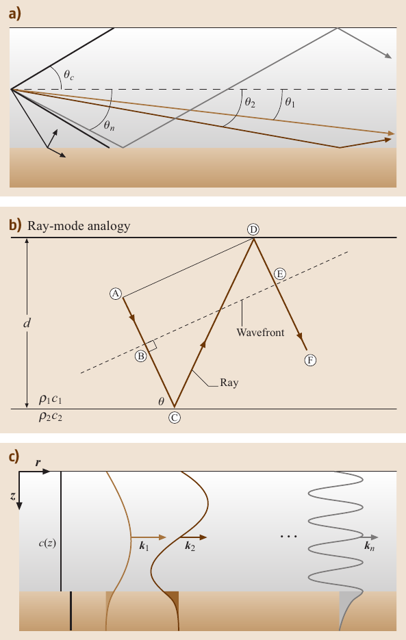
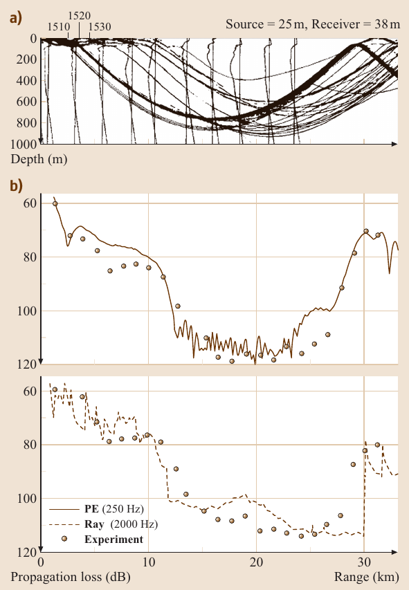
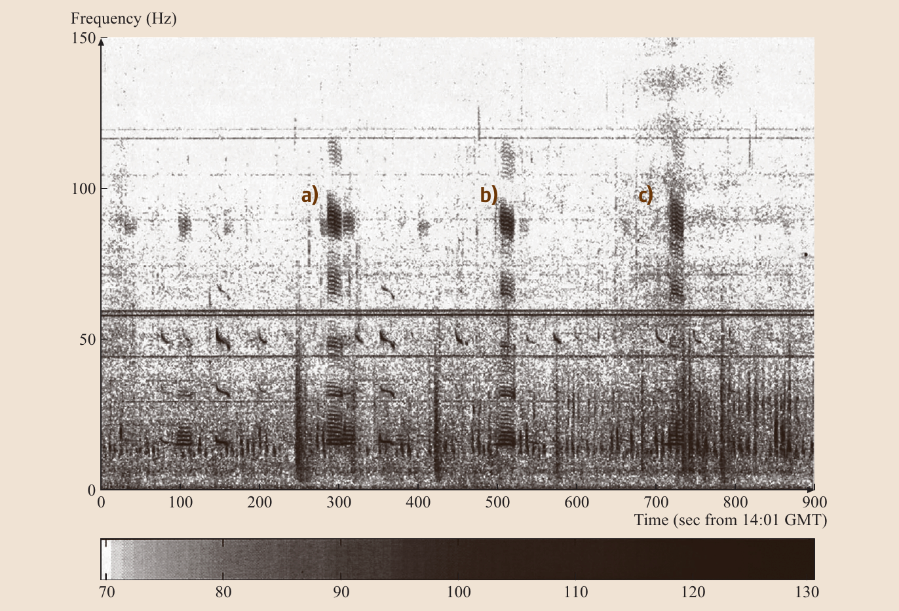

# *水声学*

 作者：William A. Kuperman, Philippe Roux。

Riket-Lee 译。

----

众所周知，与电磁波相比，声波在海洋中传播的距离很长。因此，相对于空气和真空，在海洋中人们用声而不是雷达来进行导航和测距，用声而不是无线电进行通信，用声成像和断层扫描而不是微波、光学或 X 射线断层扫描。水声学是一门研究水中声音的科学（最常见的是在海洋中），不仅包括对声传播的研究，还包括对声信号被干扰的研究以及从干扰中提取信号的信号处理研究。本章我们将介绍海洋声学的基本物理知识，然后讨论声学的应用。

---

[toc]

---

## 5 海洋声学环境

在两次世界大战期间，浅水和深水的声学研究都在进行，但在冷战期间，重点快速转移到深水上。二战后的反潜战（***A***nti***S***ubmarine ***W***arfare, ***ASW***）历史实际上始于 $1943$ 年，当时尤因（Ewing）和沃泽尔（Worzel）发现了与温度相关的声速最小值引起的深海声道（***D***eep ***S***ound ***C***hannel, ***DSC***）。前苏联的 Brekhovskikh 也独立发现了这个现象，但时间较晚。声速最小值已被绘制成图（图 5.1 中的虚线），声速最小值位置通常从两极的冰冷海面到赤道的约 $1300$ 米深度不等。由于声会向低声速折射，深海声道产生了一个由折射主导的波导（灰线），这样声通道会在声速最小值附近振荡，并且可以传播数千公里。

利用深海声道，美国海军创造了价值数十亿美元的水下监听系统（***S***ound ***O***cean ***SU***rveillance ***S***ystem, ***SOSUS***）网络，以监听前苏联的弹道导弹核潜艇。声学天线被放置在高度延伸到深海声道的海山或者大陆隆起上。这些天线使用可靠的海底电话电缆技术硬连接到陆地站。潜艇通常下潜到几百米的深度，它们在较浅的深度与深海声道连接。监听系统探测的是有不完善的旋转机械（如螺旋桨）造成的窄带宽辐射。探测一组窄带线的好处是可以过滤掉大部分的海洋宽带噪声。尽管那是一场冷战，但水下监听系统多年来的成功实际上是海军的一次重大胜利。当系统的本质被揭露时，该系统在一次间谍事件中被破坏。其结果是前苏联进入平静期，多年来前苏联舰队变得安静，降低了水下监听系统的远程能力。冷战结束后，人们开始重视在嘈杂的浅水区探测非常安静的柴电潜艇的问题，这些浅水包括世界海洋中约 $5\%$ 的大陆架，大致是从海滩到大陆架断裂处约 $200$ 米深的区域。然而，也有问题表明，人们对深水问题重新燃起了兴趣。

**图5.1** 温带地区监视系统对极地水域的潜艇进行远距离被动探测的示意图 (根据[^1])

在这些军事发展的同时，海洋声学领域也因商业、环境和其他目的而发展。由于海洋环境对声传播和声呐性能有很大影响，因此绘制海洋地图和以其他方式研究海洋的声学方法蓬勃发展。随着主动声呐被提出作为探测安静潜艇的解决方案，越来越需要研究声音对海洋哺乳动物的影响。商业上，开发了用于鱼类寻找和技术的声学方法以及水底测绘技术，后者同时具有商业和军事应用。总而言之，在过去的半个世纪里，海洋声学的研究和发展已经遍地开花，现在已有了许多标准的专著和教科书 [[^2]$^-$[^10]]。

### 5.1 海洋声学环境

海洋的声学特性，如来自局部声源的传播路径，主要取决于海洋声速结构，而其又取决于海洋环境。结合水柱和海底特性，可以得出一套描述海洋中大多数传播现象的通用声音传播路径。

#### 5.1.1 海洋环境

海水中的声速是温度、盐度和压力的函数。由于压力是深度的函数，习惯上将声速 $c$（以 $\mathrm{m/s}$ 为单位）表示为温度 $T$（以摄氏度为单位）、盐度 $S$（以千分之一为单位）和深度 $z$（以米为单位）的经验函数，例如文献 [[^7][^11][^12]]。
$$
c = 1449.2 + 4.6 T -0.055 T^2 + 0.00029 T^3 + (1.34 - 0.01T)(S - 35) + 0.016z
$$

**图5.2** 常见声速剖面。这些声速剖面反映了声速随温度和净水压力变化的趋势。浅表的混合层导致该深度区域几乎等速。在极地水域，表层温度最低。

图5.2 展示了一组典型的声速剖面，说明声速在海面近表层变化最大。在较温暖的季节（或一天中较温暖的时间段，有时称为下午效应），海面浅表层的温度升高，因此越靠近海面声速越大。在非两极区域，由于风和波浪活动的影响，导致海面浅表层混合，通常会产生一个几乎恒温的混合层。在等温层中，由于环境压力的增加（式 (1) 中的最后一项），声速随深度增加。这是表面声道区域。在混合层下面是温跃层，温度和声速都随深度下降。在温跃层下面，温度是恒定的，声速随环境压力的增加而增加。因此，在深层等温层和混合层之间，有一个最小声速的深度，此深度被称为深海声道的轴线。然而，在极地区域，在浅表层的海水是最冷的，所以最小声速出现在表面。图 5.3 是南、北大西洋声速结构的等值线图，深海声道轴线用粗虚线表示。需要注意的是，深海声道越靠近两极区域越浅。除声速影响外，海洋水体具有吸收特性，导致衰减会随声频的增加而增加。

**图5.3** 沿 $30.50^\circ \mathrm{W}$ 从北大西洋和南大西洋以 $\mathrm{5m/s}$ 间隔生成的声速等值线。 虚线表示深海声道轴。声道轴在赤道附近最深，在两极区域到达海表

较浅的水，如大陆架和大陆坡区域的水，深度不足以使式 (5.1) 中的深度压力项显著。因此，冬季的声速剖面趋向于等声速，这种现象只是因为水体充分混合。而夏季的声速剖面由于太阳照射而在近表层有较高的声速，这两种情况在图 5.4 中示意表示。

**图5.4** 典型的夏季和冬季浅水声速剖面。夏季变暖导致近表层的高声速区域。在没有强烈加热的情况下，混合层往往会使浅水区在冬季出现等声速现象

声速结构决定了声音与边界的相互作用。海洋上方以空气为界，空气是一个近乎完美的反射体。而海面往往是粗糙的，造成声向远离镜面反射角的方向散射。海底是一个复杂、粗糙、分层的结构，弹性波可以传播。其地声特性可由密度、可压缩性、剪切速度以及衰减剖面来概括。空气-海水和海水-海底这两个基本界面，可以被认为是声学波导的边界，其内部的折射率由方程 (2) 中的基本海洋参数确定。

由于水柱的密度分层，海洋内部像海表一样有各种波浪。在浅水和深水区，一种特别重要的波是内部重力波（***I***nternal Gravity ***W***ave, ***IW***），简称内波。内波的频率介于惯性频率 $f = 2 \Omega \sin \theta$（其中，$\Omega$ 是地球的旋转频率，$\theta$ 是纬度）和最高浮力频率（或 Brunt-Vaisala 频率）$N_{max}(z)$ 之间（其中 $N^2{z} = -(g/\rho)d\rho/dz$，$\rho(z)$ 是流体的密度，其与深度 $z$ 有关）。惯性频率从两极的每天两个周期到赤道的每天零个周期不等，最大的浮力频率通常 5-10 个周期。

在分层的沿海水域，有两类重力波：线性波和非线性波。线性波几乎随处可见，它服从一个标准的线性波动方程，用于恒定密度的表面（等密度面）的位移。非线性重力波是比线性重力波在更特殊的情况下产生的（因此并不总是存在），它服从一系列非线性波动方程。其中最有用和最能说明问题的的是我们熟悉的 Korteweg-deVries 方程（KdV），它控制着非线性内波的水平分量。非线性内波的垂直分量服从简正波方程。

#### 5.1.2 基本声学传播路径

海洋中的声传播可以定性地分为三类：极短程声传播、深水声传播和浅水声传播。

##### 极短程声传播

来自点声源的声压振幅随距离 $r$ 衰减为 $r^{-1}$，这种几何损失被称为球面扩散损失。深海中的大多数感兴趣声源都更靠近海面而不是海底。因此，两个主要的短程路径是直接路径和海面反射路径。当两条路径发生干涉时，它们产生的声空间分布通常被称为劳埃德镜像模式，如图 5.5 的插图所示。参考图 5.5，传播损失用分贝来衡量，即相对于单位距离处的声强值，声强随距离衰减的量（见附录），声强与声振幅的平方成正比。

**图5.5** 插图显示了劳埃德镜像效应的几何形状。图中显示了劳埃德镜像（实线）与球面传播（虚线）的比较。传播损失是以分贝为单位绘制的，分别对应于 $10 \log r^2$  和 $10 \log r^4$，如 5.1.3节所述

##### 长距离传播路径

图 5.6 是根据图 5.2 中描述的声速剖面（由虚线表示）得出的海洋声传播路径示意图。这些路径可以从斯涅尔定律中理解
$$
\frac {\cos \theta(z)}{c(z)} = \mathrm{constant}
$$
该公式将射线相对于水平面的角度 $\theta(z)$ 与深度 $z$ 的当地声速 $c(z)$ 联系起来。该方程显示，声速越高，与水平面的夹角越小，声线会从高声速区域弯曲远离，换句话说，声线会向低声速区域弯曲。因此，路径1、2 和 3 是最容易解释的，因为它们是围绕局部声速最小值振荡的路径。例如，声线 3 以一个小的水平角度离开声道轴附近的声源，在深海声道中传播。这条路径在声速最小值远离海面的温带维度可以传播数千公里的距离。

**图5.6** 海洋中各种声传播示意图。一个直观的感受是斯涅尔定律使声线转向低声速区域。这就解释了所有的折射路径：1、2和 4。它还解释了与路径 5 和 6 相关的任何曲率。因此，夏季声速剖面局域向下弯曲的路径 6（图中未显示该曲率），而低于声速最小值的声速剖面向上弯曲（4）

这条路径的上部转折点通常与温跃层有关，温跃层是一个有强内部活动的区域。路径 4 的角度较陡，通常由近海面的声源激发，在汇聚区传播，汇聚区是一种在空间周期性（$35-65$ 公里）重聚焦现象。由于深海声速剖面向上折射的性质，在海表附近产生高强度区域。汇聚区之间的区域称为阴影区。回到图 5.2，在深海等温层中，可能存在声速与其在海表相同的深度，这个深度称为临界深度，是深海声道的下线。如果临界深度在水体中，则海洋环境支持长距离传播，且在传播过程中没有与海底相互作用。如果临界深度超过水体深度，则海底是深海声道的下边界。底部反弹路径 5 也是一种周期性现象，但由于声音从海底反射时有损失，所以周期较短，传播距离也较短。最后，当地层反弹路径在波导传播的谱特性的背景下描述时，它们是根据连续水平波数区域来描述的，正如图 5.32a 相关的讨论中所阐述的那样。

##### 浅水和波导传播

一般来说，海洋可以被认为是一个声波导[^1]，这种波导的物理现象在浅水区（从近岸到大陆坡，通常深度为几百米）尤为明显。在图 5.4 中，根据斯涅尔定律，夏季声速剖面产生的声线更多地向底部弯曲，而冬季声速剖面产生的声线往往是直线。这意味着对海底的影响有两种：（1）对于固定的距离，夏季海底反弹的次数多余冬季；（2）夏季与冬季相比，射线与海底的交角更陡峭。因此，对海底反射特性的定性理解，应能很好地揭示声音在夏季和冬季的传播情况。基本上，小掠射角入射比更大、更垂直入射角的损耗小得多。由于夏季传播路径有更多的反弹，每个反弹的角度都比冬季路径的角度更陡峭，所以夏季的浅水传播比冬季的损失要大。这一结果受到冬季粗糙表面条件的影响，这些条件在较高频率下会产生大量散射损失。

为简单起见，我们考虑一个等速波导，其上界面为空气-水界面，下界面为经典定义为 Pekeris 波导的双流体界面。从 5.2.3节我们知道，在表面有 $180^\circ$ 相变的完美反射，对于低于底部临界角的掠射角，也会有完美的底部反射。因此，如图 5.7a 所示，$2\theta_c$ 锥内的射线路径将沿波导无衰减地传播。由于上行和下行射线具有相等的幅度，因此将存在相长干涉发生的优选角度。这些特定的角度与波导的简正波有关，正如从 5.4 节中的波动方程推导出来的那样。然而，理解波导简正波结构的几何起源是有益的。图 5.7b 是声线从 Pekeris 波导海底反射然后反射到海面的示意图。考虑沿路径 ABCD 的射线机器垂直于射线的波前，如果 B 点和 E 点的相位差为 $2\pi$ 的倍数（上行射线类似），则两条相同幅度的下行射线 AC 和 DF 将相长干涉，两个边界的相变必须考虑在内。有一组直到临界角的角度集，这组角度集会发生相长干涉，声音会传播。在声波物理学来看，这个离散集被称为波导的简正波，如图 5.7c 所示。它们对应于图 5.7a 的射线示意图。简正波传播在 5.4.4 节中将进一步讨论。

**图5.7** 海洋波导传播。（a）在角 $2\theta_c$ 临界角锥内的长距离传播；（b）对于所示的例子，相长干涉的条件是沿 BCDE 的相变是 $2\pi$ 的整数倍；（c）相长干涉可以解释为在波导中传播的简正波，每个简正波都有自己的水平波数。

#### 5.1.3 几何扩展损失

声源在单位时间内发出的能量，随着范围的增加，流经更大的区域。强度是指单位面积的功率通量，它转换为单位时间内通过单位面积的能量流。几何损失的最简单的例子是自由空间中点声源的球面扩散，其面积增加为 $r^2$ （$r$ 是距离点声源的距离）。所以球面扩展导致强度衰减与 $r^{-2}$ 成正比。由于强度与压力幅度的平方成正比，因此声音 $p$ 引起的压力波动会随着 $r^{-1}$ 衰减。对于与距离无关的管道传播，即折线被折射或反射回水平方向时，没有与垂直维度相关的损失。在这种情况下，扩展表面是圆柱体的面积，其轴线在垂直方向上通过源 $2\pi r H$，其中 $H$ 是管道（波导）的深度且是常数。近场劳埃德镜像区的几何损失需要考虑来自直接和表面反射路径的干扰波束。总而言之，压力场的几何扩展定律（强度与压力的平方成正比）是：

- 球面扩展损失：$p \propto r^{-1}$;
- 柱面扩展损失：$p \propto r^{-1/2}$;
- 劳埃德镜像损失：$p \propto r^{-2}$.

### 5.2 物理机制

本节将讨论与海洋中声音的产生、接收、衰减和散射相关的物理机制。

#### 5.2.1 换能器

换能器是将某种能量转换为声（发射器）或将声能（接收器）转换为电信号[^15]。在水声学中，通常使用压电陶瓷和磁致伸缩换能器。前者将电极化与机械能应变联系起来，后者将铁磁性材料的磁化与机械应变联系起来。压电式换能器占海洋中使用声源的 90% 以上。磁致伸缩式换能器更昂贵、效率低且频率带宽窄。然而，它们允许大的振动幅度，与低频高功率应用相关。此外，电动换能器，其中声压振荡通过磁场移动载流线圈，导致反电动势。以及静电换能器，其中带电电极在声场中移动，改变系统的电容。炸药、气枪、放电和激光也被用作宽带发射器。

水听器（水声接收器）通常是具有良好灵敏度和低内部噪声水平的压电设备。水听器通常在大频带宽度上工作，因为它们不需要调整到谐振频率。它们与前置放大器和滤波器等低级电子设备有关。

由于换能器领域本省就很大，我们在本节集中讨论一些非常实际的问题，这些问题对于将接收到的电压电平转换为压力电平或将发射器激励转换为压力电平非常重要。关于换能器和水听器的实际问题涉及对制造商提供的规格表的理解。其中，我们将结合实例说明以下量的定义和使用：

- 发射电压响应
- 开路接收响应
- 特定频率下发射和接收波束图
- 阻抗或导纳与频率的关系
- 谐振频率、最大电压和最大信号源水平（对于换能器）

图 5.8 是 ITC（国际换能器公司）提供的深水全向换能器规格表。图 5.8a 是发射灵敏度与频率的关系。单位为 $\mathrm{dB\ re\ \mu Pa/V @1m}$，这意味着，在谐振频率 $11.5\ \mathrm{kHz}$ 下，以 $1\ \mathrm{V}$ 振幅激励的换能器在一米处传输压力 $p_t$，这样 $20 \log_{10} \left( \frac {p_t}{1 \times 10^{-6}} \right) = 149\ \mathrm{dB}$，例如，$p_t \approx 28.2\ \mathrm{Pa}$。同样，图 5.8b 显示了接收灵敏度与频率的关系，此处单位为 $\mathrm{dB \ re \ 1V / \mu Pa}$，这意味着，以 $11.5\ \mathrm{kHz}$ 为例，换能器将 $1\ \mathrm{\mu Pa}$ 的振幅场转换为电压 $V_r$，使得 $20 \log_{10} \left( \frac{V_r}{1} \right) = -186 \ \mathrm{dB}$，即 $V_r \approx 5 \times 10^{-10}\  \mathrm{V}$。图 5.8c 显示了导纳与频率的关系。复导纳 $Y$ 是复阻抗 $Z$ 的倒数。导纳的实部称为电导 $G$；虚部是电纳 $B$。这些曲线可直接计算出换能器的电阻抗。例如，ITC-1007 在谐振频率的阻抗为 $|Z| = 1 / \left( \sqrt{G^2 + B^2} \right) \approx 115\ mathrm{\Omega}$。当用作信号源时，换能器的电阻抗必须与功率放大器的输出阻抗相匹配，以便通过换能器实现良好的功率传输。如果阻抗不匹配，将需要定制一个匹配盒。知道了电阻抗 $|Z|$ 和输入功率 $I = 10\ 000 \mathrm{W}$，最大电压可以确定为 $U_{max} = \sqrt{|Z| T} \approx 1072\ \mathrm{V}$。根据发射电压响应，这对应于谐振频率下接近 $210 \mathrm{dB \ re \ \mu Pa}$ 的源电平。最后，图 5.8d 表示给定频率下的指向性图。它表明，ITC-1007 在 $10\ \mathrm{kHz}$ 时是全向的。

**图5.8a-d**  一个水声应答器的典型规格表（左上角）。（a）发射电压响应。（b）接收电压响应。（c）导纳 $Y$ 的实部（实线）和虚部（虚线）。（d）一个频率的指向性图（由 International Transducer Corp 提供）

当换能器必须与功率放大器或其他电子设备耦合时，将换能器简化为电子电路可能会很有用（图 5.9a）。如图 5.9b 所示，电导 $G$ 和 电纳 $B$（图 5.8c）的频率依赖性差生等效电路组成部分。同样，一个重要的参数是品质因数 $Q$，它衡量传感器传输的机械能与耗散的能量之间的比率（图 5.10）。最后，等效电路得出了对电声功率效率 $k^2$ 的度量，它相当于输出声功率和输入声功率的比率。

**图5.9** （a）将换能器表示在谐振频率附近的电子电路。电阻 $R_0$ 对应于换能器中的介电损耗， 通常假设为无穷大。$C_0$ 是换能器容量，$L$ 和 $C$ 分别是裁量的质量和刚度。$R$ 包括机械损耗和换能器机械传输的能量。（b）$c_0、L、C$ 和 $R$ 的值是从规格表中给出的实-虚导纳曲线中的 $F、M$ 和 $P$ 点的位置获得的

**图5.10** 允许计算换能器在谐振频率 $f_r$ 下的品质因数 $Q = f_r/ \Delta f$ 的导纳曲线的频率相关性。$Y_m$ 是导纳的最大值

水听器通常被描述为具有与换能器相同的特性，但只用于接收的仪器。为此，水听器通常连接到具有高输入阻抗的前置放大器，以避免信号接收中的任何损失。典型的水听器在远离其共振频率的大带宽上表现出平坦的接收响应（图 5.11a）。正如预期的那样，水听器的灵敏度远高于换能器的灵敏度。低于海洋环境噪声水平的电子噪声也是水听器的一个重要特性（图 5.11b）。最后，水听器通常被设计成全向性的（图 5.11c）。

**图5.11** 水听器的典型规格表（顶部）。（a）接收频率响应。（b）与海洋环境噪声水平相比家的水听器的频谱噪声水平。（c）一个频率的指向性图（由 International Transducer Crop 提供）

#### 5.2.2 体积衰减

衰减的特点是声场呈指数衰减。如果 $A_0$ 是据声源单位距离处的声场均方根振幅，则声场的衰减会使振幅随距离 $r$ 衰减。
$$
A = A_0 \exp{(-\alpha r)}
$$
其中 $\alpha$ 的单位是 **奈贝/单位距离**。衰减系数可以通过换算 $\alpha' = 8.686 \alpha$，以 **分贝/单位距离** 表示。体积衰减随频率增加而增加，衰减的频率依赖性可以粗略地分为四个区域，如图 5.12 所示。在区域 I，声道泄露被认为是主要原因。与区域 II 和 III 相关的主要机制是硼酸和硫酸镁的化学弛豫。区域 IV 是由与淡水相关的剪切力和体粘性主导的。衰减（以 $\mathrm{dB/km}$ 为单位）的近似频率相关性（$f$ 以 $\mathrm{kHz}$ 为单位）的总结如下：
$$
\alpha'(\mathrm{dB/km}) = 3.3 \times 10^{-3} + \frac{0.11 f^2}{1 + f^2} + \frac{43 f^2}{4100 + f^2} + 2.98 \times 10^{-4} f^2
$$

**图 5.12** 在海水中传播的声音的不同主导衰减过程的区域（根据[^16]）。衰减量的单位是 $\mathrm{dB/km}$ 

在图 5.6 中，与路径 3 相关的损耗仅包括体积衰减和散射，因为该路径不涉及边界相互作用。体积散射可能源于生物，也可能源于与深海声道上部附近的内部活动的相互作用，其中路径在与海面相互作用之前被折射。这两种效应在低频时都很小。同样的内波区域也存在于表面声道的下边界，允许散射出表面声道，从而也构成了表面声道的耗损机制。这种机制还会将声音泄漏到深海声道中，该区域在没有散射的情况下将成为表面声道的阴影区。这种来自内波的散射也是声场波动的源头。

#### 5.2.3 底部损失

海底结构会影响与其作用的声学路径。底部相互作用由底部反射率概括，即海底界面处反射和入射平面波的振幅比与掠射角的 $\theta$ 的关系（图 5.13a）。对于一个简单的底部，可以用一个具有恒定声速 $c_2$ 和密度 $\rho_2$ 的半无线空间来表示，其反射率由以下公式给出
$$
R(\theta) = \frac {\rho_2 k_{1z} - \rho_1 k_{2z}}{\rho_2 k_{1z} + \rho_1 k_{2z} }
$$
其中，下标 1 和 2 分别表示水和海底。波数由以下公式给出
$$
k_{iz} = (\omega / c_i)\sin \theta = k \sin \theta_i; \ \ \ \ \ i = 1, 2
$$
入射角和透射角的关系由斯涅尔定律确定。
$$
c_2 \cos \theta_1 = c_1 \cos \theta_2
$$
入射角 $\theta_1$ 等于反射波的角度。

对于简单的水底界面，我们认为 $c_2 > c_1$，存在临界角 $\theta_c$。小于这个角度就会出现全反射现象。
$$
\cos \theta_c = \frac{c_1}{c_2}
$$
对于一个有损耗的底部，没有全反射，如图 5.13b 中的典型反射曲线所示，这些结果大致与频率无关。然而，对于分层底，反射率具有复杂的频率依懒性。需要指出的是，如果第二介质的密度消失，反射率就会降低到 $R(\theta) = -1$ 的压力释放情况。

**图5.13a,b** 反射和传输过程。 掠射角是相对于水平面的。（a）平面波入射在不同密度 $\rho$ 和声速 $c$ 的两种介质的界面上。$R(\theta)$ 和 $T(\theta)$ 是反射和透射系数。斯涅尔定律表明，波向量的水平分量 $k_{\perp}$，对于三个波都是相同的。（b）瑞利反射曲线 $R(\theta)$ 是掠射角的函数，掠射角的临界角用 $\theta_c$ 表示。虚线显示，如果第二种介质是有损的，在小于临界角情况下没有全反射。对于无损耗的底部，在小于临界角情况下有全反射，但有一个相位变化

#### 5.2.4 散射和混响

由粗糙边界或体异质性引起的散射是损失（衰减）、混响干扰和波动的一种机制。体积散射衰减已在 5.2.2 节中讨论过。多数情况下，声呐或通信应用感兴趣的是声场的平均或相干（或镜面）部分，而散射会导致声场的一部分被随机化。粗糙表面向镜面方向的散射可以被认为是平均声场的衰减，通常随着频率的增加而增加。通常用来描述粗糙边界反射率的公式是
$$
R'(\theta) = R(\theta) \exp \left( - \frac{\Gamma ^2}{2} \right)
$$
其中，$R(\theta)$ 是光滑界面的反射系数，$\Gamma$ 是瑞利粗糙度参数，定义为 $\Gamma \equiv 2k \sigma \sin \theta$，其中 $k = 2\pi / \lambda$， $\lambda$ 是声波波长，$\sigma$ 是均方根粗糙度高度[^18]$^-$[^20]。

散射场通常被称为混响。表面、底部和体积散射强度 $S_{S, B, V}$ 是混响的简单参数化，定义为单位表面积或体积散射的声音在单位距离上的强度 $I_{scat}$ 与入射平面波强度 $I_{inc}$ 的比率的分贝级。
$$
S_{S, B, V} = 10 \log \frac {I_{scat}}{I_{inc}}
$$
Chapman-Harris[^21]曲线预测了 $400-6400\ \mathrm{Hz}$ 区域的海面散射强度。
$$
S_S = 3.3 \beta \log \frac \theta {30} - 42.4 \log \beta + 2.6 \\
\beta = 107 (\omega f^{1/3})^{-0.58}
$$
其中，$\theta$ 是以度为单位的掠射角，$\omega$ 是以 $\mathrm{m/s}$ 为单位的风速，$f$ 是以$\mathrm{Hz}$ 为单位的频率。海洋表面散射在（文献 5.22）中进行了深入的讨论。

底部反射强度的简单表示利用了 Lambert 漫散射规则
$$
S_B = A + 10 \log \sin^2 \theta
$$
其中第一项是根据经验确定的。假设所有能量都散射到水体中而没有穿透到底部，$A$ 为 $-5\ \mathrm{dB}$。已测量的 $A$（文献 5.23）的典型值为：大西洋中部大型玄武岩山脊悬崖为 $-17 \ \mathrm{dB}$ 和 沉积池为 $-27 \ \mathrm{dB}$。

体散射强度通常被简化为表面散射强度，方法是将 $S_V$ 作为特定深度的某个层内的平均体散射强度，然后响应的表面散射强度为
$$
S_S = S_V + 10 \log H
$$
其中，$H$ 为层厚。综合散射强度定义为总水深为 $H$ 的情况。

除散射层外，体积散射通常随深度而减小（每 $300\ \mathrm{m}$ 约 $5 \ \mathrm{dB}$）。对于低于 $10 \ \mathrm{kHz}$ 的频率，充满气体的鱼鳔是主要的散射体。在 $20 \ \mathrm{Hz}$ 以上，以浮游生物和以浮游植物为食的小动物以及相关的生物链是散射体。深海散射层（***D***eep ***S***cattering ***L***ayer, ***DSL***）在白天比夜间深，在日落和日出期间变化最快。该层在夜间距离地表 $100$ 米内产生 $5-15 \ \mathrm{dB}$ 的强散射增加，而在白天的表面几乎没有散射，因为它向下迁移到数百米。由于较高的压力会压缩鱼鳔，当 DSL 迁移到更深的地方，背向散射声学共振（5.2.6节）在白天往往处于较高频率。昼夜散射强度的实例如图 5.14 所示。

**图 5.14** （a）白天和（b）夜间散射强度测量，使用爆炸源作为频率的函数（根据[^17]）。爆炸后不同时间测得的频谱标明了可能对混响有贡献的最近散射体深度。纵坐标与[^13]中的 SV 相对应。

最后如 5.2.6 节所述，近表面的气泡和气泡云可以被认为是与粗糙表面共同作用的体积或表面散射机制。气泡具有共振（通常大于 $10 \ \mathrm{Hz}$），在这些共振频率下，散射会强烈增强。气泡云具有集体特性，其中一个特性是，按照空隙率（气泡气体总体积除以水体积）规定，气泡混合物的声速比水低很多。

#### 5.2.5 环境噪声

海洋噪声主要有两种类型：人为噪声和自然噪声。通常，航运是最重要的认为噪声来源，尽管海上石油钻井平台的噪声正变得原来越普遍。关于人为噪声的具体例子，可参见海洋哺乳动物一节中的表 5.2。通常，自然噪声在低频（低于 $10 \ \mathrm{Hz}$）和高频（高于几百赫兹）中占主导地位。航运占据了十到几百赫兹之间的区域，而且这个分量随着时间的推移而增加[^25][^26]。噪声的频谱摘要见图 5.15。高频噪声通常根据海况（蒲福氏风级）和风进行参数化。表 5.1 总结了对海洋状态的描述。

**表 5.1** 海面描述（按照[^24]）

声速剖面影响深海噪声的垂直和角度分布。当存在临界深度时（5.1.2 节），来自海面声源的声音会传播很远的距离，而不会与海底相互作用，但在此临界深度以下的接收器应该感知到很少的海面噪声，因为传播涉及到与有损边界、海面和海底的相互作用。这在图 5.16a,b 中进行了说明，该图显示了具有测量环境噪声的深水环境。图 5.16c 是噪声垂直方向性的一个例子，它也遵循上面讨论的物理传播定律。较浅的深度在深海声道轴上，而另一个则在临界深度上。由于射线在深海声道的下边界处转向，因此在声路径区域水平的临界深度处图较窄。

**图5.15** 环境噪声谱的合成品（按照[^24]）

在一个与距离无关的海洋中，斯涅尔定律预测在声速小于近表层声速的深度会出现水平噪声缺口。回到 5.2，从图 5.16 中读出海面（$c = 1530\ \mathrm{m/s}$）和 300 米（$1500\ \mathrm{m/s}$）的声速，从海表发射的水平射线（$\theta = 0$）在 300 米深度时，相对于水平面的角度约为 $11 ^\circ$。所有其他射线将以更大的垂直入射角到达。因此，我们期待着这个水平缺口。然而，在航运噪声频率下，通常不会看到水平缺口。这是因为航运主要集中在大陆架地区，而沿着大陆坡向下传播，每次反弹都会将高角度射线转换为低角度。还有==深海声道浅化效应==，导致角度转换的相同趋势。

**图5.16** 深海噪声。（a）声速剖面；（b）太平洋中噪声等级与深度的关系（根据[^30]）；（c）太平洋中深海声道轴和临界深度处的噪声的垂直指向性（根据[^31]）

浅水中噪声的垂直方向性具有简单的环境依赖性[^27]。例如，在夏季，在一个向下折射的剖面上，与上面的讨论相同，会存在一个水平的噪声缺口。然而，冬季来自海面的噪声的垂直方向性往往是由底部特性驱动的。因此，如果底部损耗不大，则激发低阶简正波的表面声源可能来自很远的地方（因此也是很大的区域）。这些路径接近水平，因此噪声往往具有很强的水平分量。另一方面，对于损耗很大的海底将阻止长距离传播路径对噪声场产生影响，并且噪声将趋向于局部，随后是垂直的。

#### 5.2.6 气泡和气泡介质

气泡不仅在海洋中会自然产生，鱼的膘也可以被认为是气泡。气泡物理学是声学中的一大领域[^7][^28]。在这里，我们只讨论与海洋声学相关的一些方面。首先，我们从谐振器、散射体的角度讨论气泡的一些特性，然后继续讨论气泡介质和气泡散射方面的内容。

气泡散射遵循两种状态，这取决于响应入射脉动压力场的气泡振荡半径的大小[^29]：

1. 对于小压力振幅，响应是线性的。任何线性分析的第一步是确定振荡气泡的共振频率并测量气泡散射截面。
2. 由于控制方程中的非线性项，随着压力场幅度的增加，气泡的响应将收到非线性的影响。在这种情况下，气泡可能继续稳定地振荡（稳定的声学空化），在散射场中产生（次）谐波。在其他情况下，单个振荡周期中气泡的大小的变化很大，以至于气泡经历了爆炸性空化生长和剧烈崩溃的循环。这种响应被称为瞬态声空化，与稳定声空化的区别在于，气泡半径在每个循环期间变化了几个数量级。

##### 气泡作为散射体

计算线性体系中的振荡气泡的自然声学共振需要相当多的代数组合：（1）运动方程；（2）质量守恒以及（3）气泡表面的连续性关系。这些内容超出了本章的范畴。下面，我们简单总结一下最终结果，即气泡自然共振 $\omega_0^2$ 的表达式，以及在频率为 $\omega$ 的入射压力场下声学气泡的散射场的表达式。
$$
\omega_0^2 = \left[ \frac{3 \gamma p_0}{\rho_w a^2} + (3 \gamma - 1) \frac{2T}{\rho_w a^3} \right]
$$
其中，$p_0$ 是气泡外部的环境压力，$T$ 是表面张力（拉伸力/长度，单位 $\mathrm{N/m}$），$\rho_w$ 是水的密度，$\gamma$ 是比热比。对于大于 $1~ \mathrm{\mu m}$ 的气泡，忽略 公式（14）中的表面张力，并考虑声学膨胀/压缩过程是绝热的（$c_{air}^2 = \gamma p_0 / \rho_{air}$），我们得到近似表达式
$$
\omega_0 = \frac 1 a \sqrt{\frac{2c_{air}^2 \rho_{air}}{\rho_w}}
$$
对于 $c_{air} \approx 340~\mathrm{m/s}$，我们得到 $f_0 \approx \frac 3 a$，$a$ 单位为 $\mathrm{m}$，$f_0$ 单位为 $\mathrm{Hz}$。

我们现在考虑在 $ka = \omega a / c = 2 \pi a / \lambda \ll 1$ 范围内，频率为 $\omega$ 的入射平面波。辐射声场 $p_r$ 空间部分的远场表达式为
$$
p_r(r) = - \frac a r p_i \exp{\left[-\frac {i\omega} c (r - a)\right]} \times \left[ 1 - \frac{\omega_0^2}{\omega^2} \left( 1 - \frac{i\omega a}{c} \right) \right]^{-1}
$$
 首先，我们注意到在高频极限中，我们恢复了由气泡表面的边界条件给出的 $p_r(r, t) = - \frac a r p_i \left( t - \frac{r - a}{c} \right)$。

要了解谐振频率的影响，请考虑两种情况。第一种情况是 $\omega \gg \omega_0$，我们得到
$$
p_r(r)= - \frac a r p_i e^{-\frac{i \omega}{c}(r - a)}
$$
而对于 $\omega = \omega_0$ 的情况，我们得到
$$
p_r(r) = -\frac{ic}{\omega r}p_ie^{-\frac{i\omega}{c}(r-a)} = - \frac{i\lambda}{2\pi r}p_ie^{-\frac{i \omega}{c}(r - a)}
$$
比较这两个方程，公式（18）似乎是从半径为 $\lambda / 2\pi$ 的球体辐射的声场，该球体半径远大于 $a$。例如，忽略表面张力，在 1   个大气压下，$\omega_0 a \approx 20$，因此 $\lambda \approx 500a$。当考虑气泡的散射界面时，这种共振效应也非常明显。

散射界面是总散射功率（强度 × 面积 = 压力 × 速度 × 包围面积）与入射平面波强度（由 $p_i^2/2\rho_wc$ 给出，1/2 的系数来自于一个周期的平均数）的比，因此具有面积单位。我们使用公式（16）在远场中执行此计算以获得
$$
\sigma_s = \frac{4\pi a^2}{\left[ 1 - \frac{\omega_0^2}{\omega^2}\left( 1 - \frac{i \omega a}{c} \right) \right]^2} \ \underrightarrow{\omega=\omega_0}\ \frac{\lambda^2}{\pi}
$$
 这与下面讨论的相关表面积一致（公式 20）。共振使气泡的表面积看起来大于其尺寸。另一方面，对于 $\omega \ll \omega_0$ 的情况，我们有
$$
\sigma_s = 4 \pi a^2 \left( \frac{\omega}{\omega_0} \right)^2
$$
这就是瑞利散射。电磁学中类似机制解释了为什么天空是蓝色的：蓝色频率比红色高，因此散射的多。上述推导只包括辐射阻尼，我们没有包括由热传导和剪切粘性因此的耗损效应。例如公式（5.16），我们可以认为辐射阻尼常数为 $\delta_r = ka$，或者换句话说，在共振时 $\sigma_s = 4 \pi a^2 / \delta_r^2$。最后我们消光界面是散射界面和吸收界面的总和。热导率和剪切粘度的阻尼系数通常通过实验确定。

##### 气泡介质

紧接海面以下的区域是一种气泡介质（图 5.17）。气泡的存在改变了水的有效压缩性。我们定义气泡的体积分数 $\mu$（也称空隙率），以便混合物的密度简单地表示为 $\rho_m = \mu \rho_b + (1 - \mu) \rho_w$，其中下标 $b$ 和 $w$ 分别表示气泡和水。我们考虑与共振相关的低频，压缩率是体积模量 $B = \rho (\delta p / \delta \rho)$的倒数，因为它是可加的，则混合物的压缩性
$$
K_m = \mu K_b + (1 - \mu)K_w \rightarrow \frac 1 {B_m} = \mu \frac 1 {B_b} + (1 - \mu) \frac{1}{B_w}
$$
利用上述关于声速和 气泡绝热体积模量 $\gamma = 1.4$ 的讨论（水的体积模量是 $2.3 \times 10^9~\mathrm{Pa}$），我们可以得到：
$$
\frac 1 {\rho_m c_m^2} = \frac \mu {1.4p_b} + \frac{1 - \mu}{\rho_w c_w^2} \rightarrow c_m^2 = \left(  \frac{1.4p_b}{\mu \rho_w c_w^2 + 1.4 p_b (1 - \mu)} \right)c_w^2
$$
其中，我们取 $\rho_m \approx \rho_w$。带入一些典型的数字，我们取大气压 $p_b \approx 10^5~\mathrm{Pa}$，$\rho_w \approx 10^3~\mathrm{kg/m^3}$，$c_w = 1500~\mathrm{m/s}$，我们考虑两种空隙率： $\mu$ 为 $0.0001$ 和 $0.001$。气泡混合物中相应的声速分别为 $930\mathrm{m/s}$ 和 $370~\mathrm{m/s}$。少量气泡会显著改变介质的可压缩性，从而极大地改变声速。实际上，声音通过气泡介质的速度随频率而变化，因为可压缩性是体积分数变化与入射压力之比。根据公式（16），体积变化与气泡表面位移有关，因此与速度或辐射压力有关。因此，气泡可压缩性实际上与频率有关，对气泡介质中的传播进行更严格的处理会显示速度在气泡介质中的分散。

**图 5.17** （a）海岸上的波浪破碎；（b）在波浪破碎后一秒左右拍摄的羽流中单个气泡的放大图。这些羽流中空气的空隙率为百分之几，气泡的半径大小从 50 微米到几毫米不等。在公海 $15-20~\mathrm{m/s}$ 的风中，在断裂的海浪下发现的气泡羽流具有类似的尺寸分布。（由斯克利普斯海洋研究所的Grant Deane 提供）

当声音在气泡介质中传播时，由于散射和吸收，散射也会引起衰减。如上所述，消光截面 $\sigma_e$ 是这种现象的度量。对于气泡介质（以及对于单一尺寸气泡的简单情况），声束会因吸收和散射而改变。对于强度为 $I_0$ 的入射平面波，每个气泡所消除的功率为 $I_0 \sigma_e$，因此当波束传播单位体积有 $N$ 个气泡的气泡介质时，强度的变化率为
$$
\frac {dI}{dx} = - I_0 \sigma_e N \rightarrow I = I_0 \exp{(-\sigma_eNx)}
$$
因此，气泡介质会改变声速、吸收声音并频散。

### 5.3 声呐及声呐方程

水声学的一个主要应用是声呐系统技术。声呐的性能通常由声呐方程近似描述。声呐方程类似于涉及声学信号、干扰和系统特性的计算程序。图 5.18 提供了被动和主动声呐的示意图。

**图5.18** 用于潜艇探测的被动和主动声呐。被动声呐：右侧的潜艇尝试使用拖曳阵列（天线）检测来自另一艘潜艇的声音（蓝色）。这些声音会因浅水环境而失真，并掺杂在海面噪声（绿色）和睡眠航运噪声（红色）中。主动声呐：右边的船发出脉动（红色），回声（蓝色）被浅水环境扭曲并返回到船上的声呐，并将回声信号从反向散射的混响（黄色）和海洋噪声（绿色）中分离出来（根据[^1]）。

#### 5.3.1 监测阈值与接收机工作特性曲线

监测阈值（DT）[^16]是一个分贝数，他基本上包含了声呐系统（包括操作者）能否下决定的能力。监测过程包括以下概率：

- 检测概率（PD）：信号存在时被检测到的概率；
- 1-PD：信号存在时监测不到的概率；
- 误报概率（PFA）：信号不存在时被检测到的概率；
- 1-PFA：信号不存在时监测不到的概率。

实际上，由于信号和噪声是波动的，当信号和噪声的波动总和超过一个阈值时，就会进行检测（在一个时间段内），这个阈值是由噪声和信号加噪声的概率密度函数（PDF，***P***robability ***D***ensity ***F***unction）决定的。例如，单独的噪声上升到阈值以上的情况会导致误报。因此，确定检测阈值水平的过程将取决于 PD 和 PFA。通常，典型的数字可能是 PD 为 0.5，PFA 为 0.0001。概率本身将是信号和噪声统计之间关系的一个函数，由它们的平均值和方差表示。检测指数 $d$ 简明扼要地描述了这种关系，它表明在噪声中观测信号的难易程度，
$$
d = \frac{\left( M_{sn} - M_n \right)^2}{\sigma_n^2}
$$
其中，$M_{sn}$ 是信号加噪声的均值，$M_n$ 是噪声均值，$\sigma_n^2$ 是噪声方差。图 5.19 示意性地显示了检测指数的含义，其中两个概率密度函数的相对接近程度决定了检测统计量。我们首先注意到，PD 是 DT 右侧的信号加噪声曲线下的面积，PFA 是 DT 右侧的噪声曲线下的面积。那么，如果信号加噪声的 PDF 平均值更靠右（更高的信噪比（***s***ignal-to-***n***oise ***r***atio, SNR）），检测指数和 PD 会更大。

**图5.19** 噪声和信号+噪声的概率密度函数。文中解释的各种概率与曲线下的特定区域有关。因此，检测概率（PD）是信号+噪声 PDF 曲线下的浅色阴影区域，即检测阈值（粗垂直线）的右侧。同样，误报率是噪声 PDF 曲线下的深色阴影区域，它在 DT 的右边。

然后我们可以将 DT 向右移动，改变 PD，但 PFA 会更小。接收器工作特性（***R***eceiver ***O***perating ***C***haracteristics, ***ROC***）曲线是以 $d$ 为参数的 PD 与 PFA 的关系图（图 5.19）。图 5.20 给出了一个使用这种方法的典型例子，读者可参阅[^16]以获得更为完整的流程。平方律检测器通常用于处理位置信号的无源系统。在这种情况下，已经表明高斯噪声中的小信噪比、窄带信号的检测指数由以下公式给出
$$
d = \omega r \left( \frac S N \right)^2
$$
其中，$\omega、t、S\ 和\ N$ 分别是带宽（取大于信号谱线的宽度）、积分时间、信号功率和带宽中的噪声功率。如果 $1\ \mathrm{Hz}$ 是参考噪声带宽，检测指数为 $d = \omega t (S / N_0)$，其中 $N_0$是 $1 \ \mathrm{Hz}$ 频段的噪声。这给出了高斯噪声中窄带信号的能量检测器输出端的信噪比与检测指数之间的关系
$$
\mathrm{SNR} = 5 \log \left( \frac d {\omega t} \right) \equiv \mathrm{DT}
$$
其中，等效符号是指定的 PD、PFA 的检测标准。

实际上，检测阈值有一些修正因素，与用于决策的观察长度、人为因素和我们在讨论中省略的其他因素有关。由于标准是通过 ROC 曲线指定的，我们可以估计特定情况的 DT。我们只需查看所选的 PD 与 PFA 的 ROC 曲线并读取检测指数，从中我们可以计算检测阈值。例如，从图 5.20中，对于 50% 的 PD 和 0.01% 的 PFA，监测指数为 $d = 16$。使用单位带宽和积分时间，检测阈值为 $DT = 5\log 16 = 6\ \mathrm{dB}$。这种方法是下面声呐方程中 DT 项含义的一个例子，尽管 DT 和 $d$ 之间的关系因接收器和声呐的类型而不同。

**图5.20** ROC 曲线示例。对于给定的信号加噪声，不同的阈值设置对应不同的 PD 和 PFA。 ROC 曲线总结了不同阈值下 PD 和 PFA 之间的关系，通过检测指数进行参数化（根据[^16]）

#### 5.3.2 被动声呐方程

被动声呐系统使用来自目标的辐射噪声来检测和定位。辐射物体的声源级（***S***ource ***L***evel, ***SL***）（所有单位都是分贝）在声呐系统的水听器上以较低的信号级 $S$ 接收，由于会经历传播损失（***T***transmission ***L***oss, ***TL***）（例如，圆柱形传播损失和吸收损失或从第 5.4 节的传播模型计算的 $TL$），
$$
S = SL - TL
$$
从公式（27）中减去单个水听器的噪声 $N$ 以获得单个水听器的信噪比，
$$
SNR = SL - TL - N
$$
通常，声呐系统由一个水听器阵列或天线组成，通过波束形成过程提供信噪比增强（第 5.6 节）。该过程通过阵列增益（***A***rray ***G***ain, ***AG***）（参见第 5.6.2 节）以分贝为单位进行量化，该阵列增益添加到单个水听器的信噪比中，以给出波束形成器输出处的信噪比，
$$
SNR_{BF} = SL - TL - N + AG
$$
如上所述，由于检测涉及包括声呐操作员能力在内的其他因素，因此有必要指定一个检测阈值。检测阈值高于波束形成后的信噪比，在该阈值处有 50%（按照惯例）检测概率。这两个量之间的差异称为信号过剩（***S***ignal ***E***xcess, ***SE***），
$$
SE = SL - TL - N + AG - DT
$$
这种分贝记录引出了一个重要的声呐工程描述，称为品质因数（***F***igure ***O***f ***M***erit, ***FOM***），它是传播损失，产生零信号过剩，
$$
FOM = SL - N + AG - DT
$$
品质因数包含声呐工程师必须处理的各种参数：预期声源级、噪声环境、阵列增益和检测阈值。相反，由于品质因数是一种传播损失，因此可以使用传播模型的输出（或使用简单的几何衰减和吸收衰减）来估计可以预期 50% 检测概率的最小范围。该范围随海洋条件的变化而变化，在军用声呐的应用中经常被称为当天的范围。最后，我们提到正式检测理论涉及一个检测概率 PD 与 误报率 PFA 的标准。以 SNR 为参数的 PD 与 PFA 的关系图被称为接收器特征曲线（ROC）[^16]。显然，对于 PFA 为 1 的情况，检测的概率为 1。

#### 5.3.3 主动声呐方程

单基地主动声呐向目标发射脉冲，其回波在与发射器共处一地的接收器被检测到。双基地主动声呐的接收器和发射器位于不同的位置。被动和主动情况下的主要区别是增加了一个目标强度（***T***arget ***Strength***, ***TS***）项；混响（混响级，***R***everberation ***L***evel, ***RL***）通常是干扰的主要来源，而不是噪声；且传播损失包括两条路径：发射器到目标和目标到接收器。在单基地情况下，传播损失为 $2TL$，其中 $TL$ 是单向传播损失。在双基地情况下，传播损失是从发射器到目标和目标到接收器路径上的总和（以 $\mathrm{dB}$ 为单位），$TL_1 + TL_2$。检测阈值的概念对被动和主动声呐都有用。因此对于信号过剩，我们有
$$
SE = SL - TL_1 + TS - TL_2 - (RL + N) + AG - DT
$$
有源系统的相应品质因数定义为最大允许双向传播损失，$TS = 0 \ \mathrm{dB}$。

### 5.4 声传播模型

描述声音传播的波动方程来源于流体动力学方程，其系数和边界条件是对海洋环境的描述。基本上有四种类型的模型（波动方程的计算机解[^4]来描述声音在海洋中的传播：射线理论、频谱法或快速场（***F***ast ***F***ield ***P***rogram, ***FFP***）、简正波（***N***ormal ***M***ode, ***NM***）和抛物线方程。所有这些模型都考虑了海洋环境随深度变化的事实。将环境水平变化（即倾斜的底部或空间变化的海洋学）的模型称为距离有关的。对于高频（几千赫或以上），射线理论是最实用的。其他三种模型在较低频率（低于 $1 \ \mathrm{kHz}$）下更适用和可用。在这些频率之间，可选其中之一，需要注意的是波解是最准确的，并且应该在计算可行或实用的情况下使用。因为折射率对深度的依赖性比对水平距离的依赖性强得多，所以这里讨论的模型本质上是二维模型。然而，底部地形和强烈的海洋特征会导致水平折射（超出 `距离-深度` 平面）。射线模型是最容易拓展的，以包含这种特殊的情况。全三维波模型的计算量非常大。通常适用于弱三维问题的折中方法是 $N \times 2D$ 近似，它沿径向组合二维解以产生三维解。

#### 5.4.1 波动方程和边界条件

在圆柱坐标系中，用 $r = (x, y)$ 表示的平面坐标和用 $z$ 表示的深度坐标（取向下为正）的无源区域的压力 $p$ 的波动方程为
$$
\nabla^2p(r, z, t) - \frac 1 {c^2(r, z)} \frac{\partial^2 p(r, z, t)}{\partial t^2} = 0
$$
其中， $c(r, z)$ 是波传播介质中的声速。

通过假设频率相关性为 $\exp{-i \omega t}$ 的解，可以方便地在频域中求解（33）亿获得亥姆霍兹方程（$K \equiv \omega / c$）
$$
\nabla^2 p(r, z) + K^2 p(r, z) = 0
$$
其中 
$$
K^2(r, z) = \frac {\omega^2}{c^2(r, z)}
$$
与距离相关的环境本身表现为适当声速分布的偏微分方程的系数 $K^2(r, z)$。与距离相关的底部类型和地形表现为边界条件。在水声学中，流体和弹性介质（支持剪切力的沉积物和底部地层）都值得关注。为了简单起见，我们只考虑下面的流体介质。这通常是描述底部界面附近底部的一个很好的近似，因为物质通常有一个低的剪切速度，可以通过扰动程序插入到流体方程解中[^32]。

水声学中最常见的平面界面边界条件是海洋表面的压力释放条件，
$$
p = 0
$$
在海洋底部界面，压力连续性
$$
p_1 = p_2
$$
垂直分子速度
$$
\frac 1 {\rho_1} \frac{\partial p_1}{\partial z} = \frac 1 {\rho_2} \frac{\partial p_2}{\partial z}
$$
其中 $\rho_i$ 是两种介质的密度。后面这些边界条件应用于图 5.13a 中的平面波场，产生式（5）给出的瑞利反射系数。

点源声场的亥姆霍兹方程为
$$
\nabla^2 G(r, z) + K^2(r, z)G(r, z) = -\delta^2(r - r_s)\delta(z - z_s)
$$
其中下标 “s”表示源坐标。来自点源的声场 $G(r)$ 可通过求解（39）的边界值问题（频谱法或简正波），或通过使用初始值问题（射线理论、抛物线方程）近似（39）获得。

#### 5.4.2 射线理论

射线理论是（39）的几何高频近似解
$$
G(R) = A(R)\exp{\left[i S(R)\right]}
$$
其中指数项是距离快速变化的函数，$A(R)$ 是一个缓慢变化的包络，包含了几何扩散和损失机制。几何近似是振幅随距离缓慢变化（即，$1/A \nabla^2 A \ll K^2$），因此式（34）可得到程函方程
$$
(\nabla S)^2 = K^2
$$
射线轨迹垂直于恒定相位（波前） $S$ 的表面，并且可以用数学表示如下
$$
\frac d {dl} \left( K \frac {dR}{dl} \right) = \nabla K
$$
其中 $l$ 是沿射线方向的弧长， $R$ 是射线上某点的位移矢量。平均通量（能量）的方向和轨迹的方向一致，并且可以从射线密度获得任意点的场振幅。

射线理论方法计算速度快，可推广到距离相关问题。此外，射线轨迹给出了声路径的物理图像。它有助于描述声音在包括浅层和深层环境或中纬度到极地的路径上长距离传播时如何重新分布。传统射线理论的缺点是它不包括衍射，包括描述管道传播的低频依赖性的效应（陷落程度）。

#### 5.4.3 波束表示或谱解

当海洋环境不随距离变化时，可以使用谱放大有效地求解波动方程。之所以使用快速场，是由于快速傅里叶变换（***F***ast ***F***ourier ***T***ransform, ***FFT***）的出现使得频谱方法变得实用。假设公式（39）的解的形式为
$$
G(r, z) = \frac 1 {2\pi} \int_{-}^{\int}d^2kg(k, z, z_s)\exp[\mathrm{i}k \cdot(r - r_s)]
$$
然后得出深度相关的格林函数的方程 $g(k, z, z_s)$
$$
\frac{d^2g}{dz^2}+\left[ K^2(z) - k^2 \right]g = -\frac 1 {2\pi}\delta(z - z_s)
$$
此外，我们假设方位对称，$kr > 2 \ pi, r_s = 0$，因此式（43）简化为
$$
G(r, z) = \frac{\exp(-\mathrm{i}\pi / 4)}{(2\pi r)^{1/2}} \times \int_{-\infty}^{+\infty}dkk^{1/2}g(k, z, z_s)\exp(\mathrm{i}kr)
$$
然后使用快速傅里叶变化算法估计该积分。尽管该方法最初被称为快速场，但由于计算格林函数（式（44））需要时间，所以相当缓慢。然而，当人们希望计算近场区域或包含弹性介质中的剪切波效应时，它具有优势；它也经常被用作其他不太精准技术的衡量标准。通过大量的额外计算工作，这种方法可以扩展到依赖距离的环境。

#### 5.4.4 简正波模型

与其为完整集合 $ks$ 集中的每个 $g$ 求解式（44）（通常是数千次），不如利用简正波形式展开
$$
g(k, z) = \sum a_n(k) u_n(z)
$$
其中，数量 $u_n$ 是以下特征值问题的特征函数
$$
\frac {d^2 u_n}{dz^2} + \left[ K^2(z) - k_n^2 \right] u_n(z) = 0
$$
特征函数 $u_n$ 在 $z = 0$ 处为零，满足描述海底特性的局部边界条件，并满足 $z \to \infty$ 的辐射条件。对于压力，它们在希尔伯特空间中形成一个正交集，其权重函数为 $\rho^{-1}(z)$，即局部密度。与式（45）积分中的极点对应的离散特征值的范围由以下条件给出
$$
\min[K(z)] < k_n < \max[K(z)]
$$
这些离散的特征值对应于图 5.7a 中临界角锥内的离散角，如 5.1.2 节所述。特征值 $k_n$ 通常有一个小的虚部 $\alpha_n$，它用作代表海洋环境中所有损失的模态衰减。用式（46）给出的简正波展开求解式（39），得到（对于声源位于原点）
$$
G(r, z) = \frac {\mathrm{i}}{4\rho(z_s)} \sum_nu_n(z_s)u_n(z)H_0^1(k_nr)
$$
汉克尔函数的渐进形式可用于上述方程，以获得圆柱坐标系下波导的简正波表示
$$
G(r, z) = \frac{\mathrm{i}}{(8\pi r)^{1/2}\rho(z_s)}\exp{(-\mathrm{i}\pi/4)} \times \sum_n \frac{u_n(z_s)u_n(z)}{k_n^{1/2}}\exp(\mathrm{i} k_n r)
$$
方程（50）是波动方程的远场解，忽略了简正波的连续谱（式（48）中 $k_n < \min[K(z)]$ 部分）。为了说明声场的各个部分，我们注意到 $k_n$ 是一个水平波数，因此与相对于水平面的简正波相关的射线角度可以被认为是 $\theta = \cos^{-1}[k_n/K(z)]$。对于简单的波导，最大声速对应于 $\min[K(z)]$ 的底部声速。在 $K(z)$ 值处，我们可以从斯涅尔定律中得到 $\theta = \theta_c$，即底部临界角。实际上，如果我们查看简正波的射线图片，简正波谱的连续部分对应于掠射角大于图 5.13b 底部临界角的射线，因此位于图 5.7a 的锥体之外。这部分损失严重。因此，我们注意到连续谱是近（垂直）场，而离散谱是远（更水平、剖面相关的）场，远场落在图 5.7a 中的锥体内。

简正波程序的优点是：一旦特征值问题解决，该解决方案可用于所有源和接收器；使用绝热近似可以在湿度距离依赖条件下轻松扩展；使用耦合简正波理论，可以应用于及其依赖距离的环境。但是，它不包括近场的完整表示。

##### 绝热简正波理论

为海洋声学建模应用开发的所有与距离无关的简正波计算方法都适用于轻度距离依赖条件下的绝热简正波理论。基本假设是，各个传播的简正波适应当地环境，但不会相互分离或耦合。式（46）中的简正波扩展系数现在变成了距离依赖的温和函数（mild function），例如 $a_n(k) \to a_n(k, r)$。这将式（45）修改如下
$$
G(r, z) = \frac{\mathrm{i} \rho(z_s)}{(8 \pi r)^{1/2}} \exp{(-\mathrm{i}\pi/4)} \times \sum_{n}\frac{u_n(z_s)v_n(z)}{\overline{k_n^{1/2}}} \exp{(\mathrm{i}\overline{k_n} r)}
$$
其中距离平均波数（特征值）是
$$
\overline{k_n} \frac{1}{r} \int_0^rk_n(r')dr'
$$
并且 $k_n(r')$ 是从特征值问题（47）的每个距离段获得的，该问题针对沿路径的特定范围内的环境进行评估。量 $u_n$ 和 $v_n$ 分别是源和场位置的简正波集。

简单地说，绝热简正波理论导致了对声传播的描述，是的声场是声源和接收器的简正波结构的函数，以及两者之间的一些平均传播条件。因此，例如当声音从近存在两种离散简正波的浅层区域发出并传播到具有相同底部（相同临界角）的较深区域时，来自浅层区域的两种简正波将适应前两种简正波的形式。但是深层区域可以支持更多的简正波；直观地，我们因此预计在深部区域产生的两种简正波将占据图 5.7a 椎体中更小、更水平的部分，而不是他们在浅层区域中占据的部分。这意味着从浅到深区域的声线将趋向于变得更加水平，这与下坡传播的声线图像一致。最后，已经扩展了用于距离依赖环境的完全耦合简正波理论，但需要大量的计算。

##### 波导中的简正波频散

简单自由空间中的声传播是非频散的。也就是说，所有平面波都以与频率无关的速度传播。此外，它们的群速度和相速度与介质声速相同。然而，几何频散是波导传播的一个特性。

我们考虑 Pekeris 类型的浅水波导，即同质的水体覆于同质且密度更大的流体底部之上。这种类型的波导支持简正波传播，其中每个模式的特征是与深度简正波振幅 $u_n(z)$ 和水平投影传播波数 $k_n$ 相关的。每个简正波的特征是群速度 $v_{gn}$ 和相速度 $v_{\varphi n}$，它们之间的关系通过公式给出。
$$
\frac 1 {v_{gn}} = v_{\varphi n} \int_0^\infty \frac{u_n^2(z)}{\rho(z)c^2(z)}dz
$$
在具有恒定声速 $c$ 且底部没有穿透的完美波导情况下，式（53）采用最简单的形式 $v_{gn}v_{\varphi n} = c^2$。简正波之间的群速度差异导致波导中的简正波频散（图 5.21）。

**图5.21** 在水深 100 米、底部声速 $c_b = 1600 \ \mathrm{m/s}$、密度为 $1800 \ \mathrm{kg/m^3}$ 的 Pekeris 波导中，简正波的群速度（下边曲线 $1-6$）和相速度（上边曲线 $1-6$）随频率的变化。水中声速 $c_w$ 为常数，等于 $1500 \ \mathrm{m/s}$。粗体垂线分别表示简正波 $4-6$ 的截止频率。

在浅水中，低阶简正波通常比高阶简正波传播的更快（图 5.22 和 5.23）。在深水中，深水通道表现为波导，最快的简正波是高阶简正波（图 5.24），这是一种以折射为主的简正波传播特性。由于简正波波数 $k_n$ 是与频率相关的，因此可以在频率-波数空间中绘制简正波，该空间是图 5.25中分散场的时间范围表示的傅里叶变换。正如在图 5.21 中看到的那样，图 5.26 显示简正波具有截止频率，并且在给定频率下存在有限数量的传播简正波。

**图 5.22** 浅水波导中的声频散。右图（b）对应于 $R = 20 \ \mathrm{km}$ 处对左图中现实的发射信号（中心频率为 $100 \ \mathrm{Hz}$，$50 \ \mathrm{Hz}$ 带宽）的波导响应。左图（a）声源深度为 $40 \ \mathrm{m}$，接收器深度为 $60 \ \mathrm{m}$。波导参数与图 5.21 中的相同。

**图5.23** 在 $R = 20 \ \mathrm{km}$ 的浅水波导中传播后场强的深度与时间表示。波导特性与图 5.21 相同。声源深度为 $40 \ \mathrm{m}$。色板以 $\mathrm{dB}$ 为单位，声源处的声强级为 $0 \ \mathrm{dB}$。 

**图5.24** 在深水波导中 $R = 2000 \ \mathrm{km}$ 传播后场强的深度与时间表示。我们使用 Munk 剖面作为与深度相关的声速剖面。声源深度为 $900 \ \mathrm{m}$，声源频率为 $22.5 \ \mathrm{Hz}$，带宽为 $15 \ \mathrm{Hz}$。色板以 $\mathrm{dB}$ 为单位，声源处的声强级为 $0 \ \mathrm{dB}$。 

**图5.25** 与图 5.21 中相同的波导和声源-接收机深度的场强范围的距离-时间表示。该图清楚地表明，简正波一波通的速度移动。迟滞时间 $t = t - \frac R {c_w}$。色板以 $\mathrm{dB}$ 为单位，参考距离 $5 \ \mathrm{km}$ 处参考声强为 $0 \ \mathrm{dB}$。

**图5.26** 波导中频散场的频率-波导表示。（a）从图 5.25 中距离-时间图的二维快速傅里叶变换获得。传播的简正波的波数受波导中声速的上下限 $\omega / c_w$ 和 $\omega / c_b$ 的限制。（b）（a）的旋转版本，因此水中的声速看起来是无限大的。这种表示方法更容易看到简正波分离和截止频率。色标的单位是 $\mathrm{dB}$。

##### 频散和波导不变量[^3]

实际上，有哦一个相当稳健的参数，即波导不变量，它描述了一组简正波区间内（有时很大）的频散情况。波导不变量有两个重要的解释：它与简正波群速度的局部变化相对于相速度的变换有关，
$$
\frac 1 \beta = - \frac{\partial S_g}{\partial S_p}
$$
其中 $S_g$ 和 $S_p$ 分别是群慢度和相慢度，其中慢度是速度的倒数。

事实证明，$\beta$ 在某些情况下通常具有相当稳健的值。例如，对于许多以底反射为主的浅水情况，它是统一的；另一方面，它对于折射主导的传播是负面的。

图 5.27 显示了太平洋深水案例的计算。从定义中注意，$\beta$ 是负的，直到大约 1540 的相速度；该区域是深水通道和汇聚带传播等的折射区域。超过 1540，$\beta$ 为正；这是有反射而不是折射主导的底部反弹区域（bottom bounce region）。

**图5.27** 太平洋深水案例中的群速度与相速度。 曲线是针对不同频率的，从最低频率 $60 \ \mathrm{Hz}$ 开始。 低相速度对应低模态数

该不变量还将传播损失曲线的干扰峰值位置的距离变化与频率变化联系起来
$$
\frac{\Delta r}{r} = \frac 1 \beta \frac{\Delta \omega}{\omega}
$$
在图 5.28 中，我们展示了一组不同频率的传播损失曲线；干扰峰根据不变公式移动。表示这种偏移的另一种方法是通过条纹，其中传播损失是频率距离图的第三维，如图 5.29 所示，他来自浅水传播损失数据。如果将距离表示为辐射器速度和时间的乘积，那么距离轴可以用时间代替，并且有一个频率-时间图，通常被称为频谱图。传播损失曲线是转换为适当距离的给定频率和时间的频谱图切片。

**图5.28** 传播损失在 $130$ 到 $170 \ \mathrm{Hz}$ 范围内的关系，由 OASES（海洋声学地震勘探综合）计算，该环境由200米的均质流体层覆盖在均质、吸收性流体半空间。流体层的声速为 $1450\ \mathrm{m/s}$，而下半空间的声速为 $1500 \ \mathrm{m/s}$，衰减为 $10 \ \mathrm{dB/λ}$。 增加频率的曲线以 $1 \ \mathrm{dB}$ 的步长逐渐偏移。 声源和接收器深度分别为 $20$ 和 $100 \ \mathrm{m}$

**图5.29** 宽带移动源频谱图数据示例。 条纹是传输损耗的干涉图案中的峰值。 如果知道源的路径和速度，时间轴将转换为距离（按照文献 5.35]）

##### 波导中的多普勒频移

涉及移动声源和接收器的多普勒频移理论在声学中是很常见的，尤其是在自由空间中。然而，在波导中，即使我们将自己限制在水平运动上，结果也会稍微复杂一些。根据图 5.7a，与简正波传播相关的各个路径都对于水平面具有有限且不同的角度。因此，每种简正波都有不同的多普勒频移。声源和接收器的波导理论已经给出（详见[^33]，其中也有相关文献的回顾）。对于角频率为 $\omega$ 的谐波源，我们返回到式 50，因此对于时域中的 $e^{-\mathrm{i}\omega t}$ 的每一项，都会产生一个额外的、相同的（当没有运动时）因子。我们现在考虑具有频谱 $S(\omega)$ 的声源。对于恒定的水平速度，接收器参考系中的简正波结果仍然有效
$$
\psi(r_0 + v_r t, z, \omega) = \frac{\mathrm{i}}{4 \rho(z_s)} \times \sum_n S(\Omega_n)u_n(z_s)u_n(z)H_0^1(k_nr)
$$
但多普勒频移模态波数
$$
k_n \to k_n\left( 1 + \frac{v_r}{v_gn}\cos \theta_r \right)
$$
和多普勒频移频率（现在是求和中的每个模态相）
$$
\Omega_n = \omega - k_n (v_s \cos \theta_s - v_r \cos \theta_r)
$$
其中 $v_{gn}$ 是第 $n$ 阶简正波的群速度，$v_s \cos \theta_s$ 是声源的径向速度，$v_r \cos \theta_r$ 是接收器的径向速度。此处径向是指速度在声源和接收器之间的水平线上的投影。请注意后一个表达式，当乘以波数时，表明频率偏移和速度与简正波相速度的比率成正比，而不是波数偏移涉及群速度。

#### 5.4.5 抛物线（***P***arabolic ***E***quation, ***PE***）模型

抛物线方程法被引入海洋声学，并随着 Tappert 分步算法的发展变得可行，该算法在每个步长中利用快速傅里叶变换[^6]。随着数值发展，极大地扩展了抛物线方程方法的适用性和准确性。

##### 标准抛物线分步算法

抛物线方法目前是最实用和最全面的波理论中与距离相关的传播模型。在其最简答的形式中，它是相对于水平面的远场窄角（$\approx 20^\circ$），适合许多水下传播问题，是波动方程的近似值。假设一个声源的方位角是对称的，我们在无源区域的柱坐标系中用以下形式表达式（34）的解
$$
p(r, z) = \psi(r, z)H(r)
$$
我们定义 $K^2(r,z) \equiv K_0^2n^2$，因此 $n$ 是折射率 $c_0/c$，其中 $c_0$ 是参考声速。将式（59）代入式（34）并以 $K_0^2$ 作为分离常数，我们最终得到贝塞尔方程 $H$，其汉克尔函数为输出解。如果我们使用汉克尔函数的渐进形式 $H_0^1(K_0r)$，并调用近轴（窄角）近似，
$$
\frac{\partial^2 \psi}{\partial r^2} \ll 2K_0 \frac{\partial \psi}{\partial r}
$$
我们得到抛物线方程，
$$
\frac{\partial^2 \psi}{\partial z^2} + 2 \mathrm{i}K_0 \frac{\partial \psi}{\partial r} + K_0^2(n^2 - 1)\psi = 0
$$
我们注意到 $n$ 是距离和深度的函数。我们使用行进解来求解抛物线方程。已经有各种各样的数值解决方案，但标准的仍然是所谓的分步距离行进算法，
$$
\psi(r + \Delta r, z) = \exp\left[ \frac{\mathrm{i }K_0}{2} (n^2 - 1) \Delta r \right] F^{-1} \times \left\{ \left[\exp \left( - \frac{\mathrm{i}\Delta r}{2 K_0}s^2 \right) \right] F[\psi(r, z)] \right\}
$$
傅里叶变换 $F$ 是使用快速傅里叶变换 $FFT$ 执行的。方程（62）是 $n$ 常数的解，但是当 $n$ （剖面或测深）随距离和深度变化时引入的误差可以通过增加变换大小和减小距离步长来任意变小。可以修改分步算法以提高其相对于更高角度传播的准确性。

##### 广义或高阶抛物线方法

最近出现了解决抛物线方程的方法，包括扩展到更高角度的传播、弹性介质，以及包括非线性效应的直接时域解决方案（例如，参见[^34]）。特别是，当声线更加垂直时，准确的高角度解决方案是很重要的，例如当底部具有非常高的速度，因此相对于水平面有很大的临界角。此外，对于弹性传播，压缩波和剪切波跨越了一个广角空间。最后，用于脉冲建模的傅里叶合成需要高精度的相位，而大角度抛物线方程的相位更准确，及时在低角度也是如此。

方程（61）的二阶距离导数由于式（60）而被忽略，可以用运算符表示法写成
$$
[P^2 + 2 \mathrm{i}K_0 P + K_0^2 (Q^2 - 1)] \psi = 0
$$
其中，
$$
P \equiv \frac{\partial}{\partial r}, \ \ Q \equiv \sqrt{n^2 + \frac 1 {K_0^2} \frac{\partial^2}{\partial z^2}}
$$
假设距离依赖较弱，对式（64）因式分解，并仅保留与向外传播相关的因素，就可以得到一个单向的方程
$$
P\psi = \mathrm{i}K_0(Q - 1)\psi
$$
这是抛物线方程的推广，超出了与式（60）相关的窄角近似。如果我们定义 $Q = \sqrt{1 + q}$ 并将泰勒技术中的 $Q$ 展开为 $q$ 的函数，则标准抛物线方法可以通过 $Q \approx 1 + 0.5q$ 恢复。可以从 $Q$ 算子的 Pade 级数表示中获得角度、相位等任意精度的广角抛物线方程，
$$
Q \equiv \sqrt{1 + q} = 1 + \sum_{j = 1}^n \frac{a_{j,n}q}{1 + b_{j, n}q} + O(q^{2n + 1})
$$
其中 $n$ 是 Pade 展开式中的项数，且 
$$
a_{j,n} = \frac{2}{2n + 1} \sin^2 \left( \frac{\mathrm{j}\pi}{2n + 1} \right), \ \ b_{j, n} = \cos^2 \left( \frac{\mathrm{j}\pi}{2n + 1} \right)
$$
使用公式（66）和（67）对（65）的求解使用流体和弹性介质的有限差分技术实现。

#### 5.4.6 传播和传输损耗

传播损失（***PL***, ***P***ropagation ***L***oss）和传输损耗（***TL***, ***T***ransmission ***L***oss）是以分贝（见附录）为量纲的，它们要么是测量的，要么是从传播模型中推导出来的。它们表示声场强度的损失，是相对某个位置的距离的函数。对于建模，我们通常使用距离声源一米距离的强度，假设球面扩散超过一米。因此，如果声压 $P$ 是传播代码的输出，则传播损失为
$$
PL = 20 \log \left|\frac P {p_0(r = 1)} \right| \equiv -TL
$$
其中，$p_0$ 是声源在自由空间中的压力。传输损耗是一个正数。

通常，人们会看到对相干和非相干传播损失的引用，这可能会令人困惑。确定论物理学将所有的声学传播视为相干的。如果介质具有一定的随机性，则相位信息会因某种平均过程而丢失，这引出了非相干传播的想法。在简正波理论中，结果是涉及模态波束差异的交叉项没有贡献，因此传播曲线是平滑的，没有干涉图案（图 5.30c）。显然，这种计算对于简正波很容易，但对于其他波模型，除了实际引入随机性之外， 没有等效的简单方法。图 5.30 显示了这种非相干模式之和的应用。在浅水中，非相干模式的总和或多或少相当于频率平滑，例如超过三分之一倍频程。图 5.30a 中所示的环境与图 5.30b 中所示的三倍频程传输损耗与频率和距离的关系的实验数据轮廓相对应。简正波模型运行如图 5.30c 所示，其中简正波相加不连贯。图 5.30d 是相同类型简正波计算的模型结果，但在整个频谱范围内，注意出奇的一致性。这种分析可以反复用来估计环境。图 5.30b 和图 5.30d 指的是最佳频率曲线，因为 $300-400 \ \mathrm{Hz}$ 似乎是最佳传播频率。例如，在 60 公里处的垂直切片表明，最小的损失在该频率区间。图 5.30c 中的曲线是图 5.30d 中等值线的水平切片。最佳频率来自低频下进入底部的高损耗的组合，因为进入有损耗底部的渗透增加，以及由于散射和其他倾向于具有频率平方相关性的水体衰减效应而导致的高频高损耗。因此，存在一个中间频率，在这个频率上，底部损耗较小，频率平方相关性不占优势。

**图5.30a-d** 浅水环境的最佳频率曲线。 (a) 浅水环境。 声源和接收器深度由箭头标记。 (b) 三倍频程传输损耗数据随频率和距离的等值线。 (c) 非相干简正波传输损耗。 (d) 非相干传输损耗的轮廓看起来很像
(b) 中的数据

最后我们注意到，也有一种非相干的射线之和，其中射线强度不是相位振幅相加。这不等同于不连贯的简正波总和。例如，非相干简正波的总和不会产生汇聚区，而非相干射线则显示汇聚区属性。

#### 5.4.7 频域解的傅里叶合成

使用傅里叶变换，可以将波动方程的频域解 $p(r, z, \omega)$ 转换为瞬态解 $p(r, z, t)$，我们有
$$
p(r, z, t) = \frac 1 {2\pi} \int_{-\infty}^{+\infty} S(\omega)p(r, z, \omega) e^{-\mathrm{i}\omega t}d\omega
$$
$S(\omega)$ 是源频谱，定义为
$$
S(\omega) = \int_{-\infty}^{+\infty}s(t)e^{\mathrm{i}\omega t}dt
$$
其中，$s(t)$ 是研究时域解 $p(r, z, t)$ 的脉冲源。在使用式（69）前，传递函数 $p(r, z, \omega)$ 必须由上述频域（或连续波（***CW***, ***C***ontinuous ***W***ave））传播模型之一在多个离散频率下确定感兴趣的频段。这意味着海洋对脉冲 $s(t)$ 的响应是通过将方便且计算效率高的 CW 编码（频谱积分、简正波或抛物线方程）与傅里叶合成方法结合而获得的。即使最后一步在概念上很简单，也有几个数值问题需要解决，例如频率和时间窗口，以及混叠。

通过（快速）傅里叶变换评估频率积分的第一步是减少积分间隔。声源脉冲 $s(t)$ 是已知的，频率间隔 $(\omega_{min}, \omega_{max})$ 被确定，在间隔之外，声源不发射任何显著的能量。此外，最终的时域解 $p(r, z, t)$ 是实数，我们知道 $p(r, z, -\omega) = p(r, z, \omega)$  。这将式（69）中的积分减少到 $[\omega_{min}, \omega_{max}]$ 。
$$
p(r, z, t) = \mathrm{Re}\left[\frac 1 \pi \int_{\omega_{min}}^{\omega_{max}} S(\omega) p(r, z, \omega) e^{-\mathrm{i}\omega t} \right]
$$
现在，必须在区间 $[\omega_{min}, \omega_{max}]$ 上执行积分的离散频率集取决于信号采样频率 Fs 的选择以及最终解 $p(r,z , t)$ 的时间扩展 T 的一些先验知识。首先，采样频率 Fs 必须满足奈奎斯特采样准则 $Fs > 2f_{max} = (\omega_{max}/pi)$。通常为了获得合理的图形信号显示，合适的值是 $Fs = 8f_{max}$。其次，信号通过海洋传播后的时间窗口 T 应尽可能短。然而，这个时间窗口必须根据波导物理性质来选择。估计时间传播的保守方法是考虑 T 受特定环境的最慢和最快可用速度的限制：
$$
T = t_{max} - t_{min} \ge R \left( \frac 1 {c_{min}} - \frac 1 {c_{max}} \right)
$$
其中，$R$ 是传播距离。通过正确选择 T 和 Fs，我们构造了 n 点时间向量 $t = \left[ 0:\frac 1{F_s} : T \right]$，$N = F_s T + 1$ 和频率矢量 $\frac \omega {2\pi} = \left[ 0: \frac {F_s}{N}: F_s\left(1 - \frac 1 N \right) \right]$。时间向量 t 对应于时间轴，时间相关解 $p(r, z, t)$ 将根据区间 $[\omega_{min}, \omega_{max}]$ 内的频率向量 $\omega$ 的频率区间计算得出。在计算傅里叶变换之前，需要在积分 $\exp(-\mathrm{i}t_{min} \omega)$ 上添加延迟时间，以便时间向量 t 开始与可能最早的到达时间 $t = t_{min} + \left[ 0:\frac 1{F_s} : T \right]$。根据式（71），$t_{min}$ 的合理选择是 $t_{min} = (R / c_{max})$。它遵循：
$$
p(r, z, t) = \mathrm{Re} \left \{ \mathrm{IFFT}[S(\omega) p(r, z, \omega) r^{-\mathrm{i}\omega t_{min}}] |_{\omega_{min}}^{\omega^{max}} \right\}
$$
其中对区间 $[\omega_{min}, \omega_{max}]$ 中的频率向量 $\omega$ 执行逆快速傅里叶变换（IFFT）。我们在此不讨论众多（快速）傅里叶变换算法，这些算法可以在信号处理或数值方法书籍中找到。这种宽带建模的典型结果如图 5.22-5.25 所示。

### 5.5 传播的定量描述

上述所有模型都试图描述现实并以一种或另一种方式求解亥姆霍兹方程。 因此，它们应该是一致的，并且可以从理解这种一致性中获得很多见解。 这些模型最终计算传播损失，该损失被视为现场点压力与参考压力（通常距离声源一米）的分贝比（见附录）。 

图 5.31 显示了简化剖面的会聚区类型传播。 图 5.31b 中的声线轨迹显示了 5.1.2 节中讨论的循环聚焦。相同的声速剖面用于计算简正波，如图 5.31c 所示，当根据（式 50）参考 $1 \ \mathrm{m}$ 的求和时，表现出与射线图片相同的循环模式。 图 5.31d 显示了简正波（波动理论）和射线理论的结果。 如同预期的那样，射线理论表现出界限分明的阴影区，而包括衍射在内的简正波理论则表明，声场确实存在于阴影区，而且会聚区具有结构。

**图5.31** 射线理论和正常模式理论之间的一致性。 (a) 声速剖面，(b) 射线轨迹，(c) 法向模式，(d) 传播计算。 (d) 中的阴影区域对于不包括衍射效应的射线理论来说要清晰得多 

简正波模型将离散简正波加起来，大致对应于图 5.7a 锥体内的传播角度。谱系法可以包括整个场，离散加连续，后者对应于较大的角度。下面的讨论（式 50）用水平波数来定义这些角度，而简正波问题的特征值是一组离散的水平波数。因此，谱法的被积函数（格林函数）在与简正波相关的特征值处有峰值。这些峰值显示在图 5.32a 的右侧。频谱中比较平滑的部分是连续部分，对应于较大的角度。因此，我们期望简正波和谱方法与图 5.7 物理属性之间的一致性是谱解的连续部分，它随距离快速衰减，因此简正波和谱解决方案之间应该在长距离上完全一致。劳埃德镜面效应，一种近场效应，也应该在谱解中表现出来，而不是在简正波解决方案中表现出来。这些方面在图 5.32b 中都很明显。抛物线方程解决方案与其他方案有很好的一致性，但存在与分步法中选择的平均波数相关的一些相位误差。方法中必须选择的平均文数。抛物线方程解决方案包括劳埃德镜波束在内的部分连续光谱，在短距离上比简正波解决方案更准确；然而，通过在（式 66）中包含更多扩展项，可以使广义抛物线方程在短距离上任意准确。

**图5.32a, b** 谱 (FFP)、简正波(NM) 和分步抛物线方程模型 (PE) 计算之间的关系。 (a) 来自 (44) 的 FFP 格林函数。 (b) 简正波、谱 (FFP) 和抛物线方程传播结果显示近场中的一些一致性和远场中的完全一致。 高阶抛物线方程方法将给出与谱法相同的结果

距离相关的结果如图 5.33 所示。 声线跟踪、声线跟踪场场结果、抛物线方程结果和数据一起绘制，用于与距离相关的声速剖面环境。 这些模型大体上与数据一致，除了射线结果预测会聚区的前缘过于尖锐。上坡传播用图 5.34 中的抛物线方程建模。当场向上倾斜传播时，声音会以离散波束的形式倾泻到底部。平坦区域具有三种简正波，随着声音传播到较浅的水中，每种简正波都会被相继切断。射线图也对这种现象有一致的解释。每种简正波的声线随着向上倾斜传播而变得更陡峭。当射线角超过临界角时，声音会明显低传播到底部。  

**图5.33a, b** 距离相关案例的模型和数据比较。 (a) 表面管道消失情况下的轮廓和声线追踪。 (b) $250 \ \mathrm{Hz}$ PE 和 $2 \ \mathrm{kHz}$ 声线追踪与数据的比较。 无衍射射线理论显示了场的更突然变化

### 5.6 声呐阵列处理

信号处理在许多领域中很常见[^36]$^-$[^38]。在本节中，我们强调水声学的应用，主要集中在压力场的空间处理上。不过，我们注意到，人们对处理矢量场（例如声学位移、速度和加速度）也越来越感兴趣[^39]。此外，下面讨论的无源声呐阵列处理也适用于有源声呐信号处理。声场的空间采样通常由换能器阵列完成，但合成孔径阵列是一个重要的例外，其中传感器在空间中移动以获得时域和空域的测量值。空间采样类似于时间采样，采样间隔有传感器间距代替。奈奎斯特准则要求传感器间距至少是被测声场空间波数的两倍。最后，我们注意到，最近处理环境噪声场的工作也被证明可以产生有关海洋环境的信息[^40][^41]。

#### 5.6.1 线性平面波束形成和时空采样

阵列处理的最简单示例是频域中的相位阴影（Phase Shading）或时域中的时间延迟，以搜索平面波信号的方位。该过程称为平面波波束形成，或时域中的延迟求和波束形成。为简单起见，我们考虑一个线性阵列，我们取 $\theta$ 作为与平面波信号相关的方位角，如图 5.35a 所示。

**图5.35a, b** 阵列处理。 (a) 平面波波束成形的几何形状。 (b) 数据被转换到频域，在频域中进行平面波处理。 交叉谱密度矩阵 (***CSDM***, ***C***ross-***S***pectral-***D***ensity ***M***atrix) 是给定频率的数据向量的外积

##### 频域处理

平面波可表示为
$$
s(\theta) = \exp{(\mathrm{i} \boldsymbol{k} \cdot \boldsymbol r)}
$$
我们抑制了时间依赖性 $\exp{(-\mathrm{i}\omega t)}$ 和 $k = |\boldsymbol k| = (\omega / c)$。如果位置 $d$ 处的接收元件（水听器或麦克风）的输入被乘以平面波相位系数的复共轭，则该场是相位相加的。
$$
\omega_i^* = \exp{(-\mathrm{i} \boldsymbol k_s \cdot \boldsymbol d_i)} = \exp{(-\mathrm{i}d (k\sin \theta_s))}
$$
其中 $\theta_s$ 是扫描角度。当扫描角等于信号的入射角时，这个过程将有最大值。

这个波束形成过程的输出被表示为 $B(\theta_s)$，当通常感兴趣的是波束形成器的功率输出：
$$
B(\theta_s) = \left| \sum_{i = 1}^m \omega_i^*(\theta_s) [s_i(\theta) + n_i]\right|^2 = \sum_{i, j = 1}^m \omega_i^*(\theta_s) (s_{ij} + n_{ij}) \omega_j(\theta_s)
$$
其中，$s_i$ 和 $n_i$ 是第 $i$ 个接收元件的信号和噪声，其中 $s_{ij} + n_{ij}$ 是交叉谱密度矩阵的元素，当从数据中获得时，将涉及傅里叶变换和集合平均，如下面讨论中提到的（78）由图 5.35b 扩充。在写下（76）的右手边时，假设信号场和噪声场是互不相干的。

我们可以用矩阵表示法来写上面的表达式，其中粗体小写字母表示向量，粗体大写字母表示矩阵。 定义第 $i$ 个元素为 $w_i$ 的转向列向量 $\boldsymbol{w}$，信号和噪声的交叉谱密度矩阵 (CSDM) $\boldsymbol{K}$，假定信号和噪声是独立的，则元素 $K_{ij} = s_{ij} + n_{ij}$ 。 方程（76）可以改写为

$$
B(\theta_s) = \boldsymbol{w}^{\dagger} (\theta_s)\boldsymbol{K}(\theta_{true}) \boldsymbol{w}(\theta_s) \equiv  {w}^{\dagger}\boldsymbol{K}\boldsymbol{w}
$$
其中 $\dagger$ 表示复数转置。 CSDM 或场的协方差由不相关的信号和噪声协方差组成，
$$
\boldsymbol{K} = \boldsymbol{K_s} + \boldsymbol{K_n}
$$
矩阵 $\boldsymbol{K}$ 中表示的阵列中的数据包含源在方向 $\theta_{true}$ 上的信息。 有时 $\boldsymbol {w}(\theta_s)$ 被称为副本，并且此波束形成过程被视为将阵列中接收到的数据与副本进行匹配。 由式（77）表示的波束形成器类型称为线性或 Bartlett 波束形成器。

对于样本协方差估计，我们假设我们有一个在 $d_i$ 处有 $N$ 个传感器的阵列，$i = 1, 2, \cdots, N$ 和一个窄带模型，如图 5.35b 所示。 这些协方差是通过使用采样窗口 $W(t)$ 将接收到的数据 $r_i (t)$ 分割成快照来估计的，$W(t)$ 在区间 $[0, T_w ]$ 中是统一的，
$$
R_i^l(f)=\int_{T_l}^{T_l+T_w}r_i(t)W(t - T_l)e^{-\mathrm{i}2\pi ft}dt
$$
这里的符号使用频率 $f$ ，而不是角频率 $ω$。 在大多数波束形成算法中，数据向量被平均以形成样本协方差矩阵
$$
\hat{K}(f) = \frac 1 L \sum_{l = 1}^L R^l(f)R^l(f)^H
$$
其中 $L$ 是快照数量。

##### 时域处理

时间延迟信号是时域模拟信号在频域中的相位阴影。通常，在处理时间脉冲等相干宽带信号时，时域是频率分析的可行替代方案。 时延波束成形是第 5.6.1 节中描述的相位波束成形的频率等效项。实际上，可以通过对波束形成过程进行傅立叶变换来形式化推导出波束形成器输出为
$$
\begin{equation}
	\begin{split}
	b(\theta, t) &= \int_{-\infty}^{+\infty} B(\theta, \omega) \exp{(\mathrm{i}\omega t)} d \omega \\
	&= \int_{-\infty}^{+\infty} \sum_i R_i(\omega)\exp{\left( -\mathrm{i} \frac {\omega}{c_i}d_i \sin \theta\right)} \times \exp{(\mathrm{i} \omega t)} d \omega \\
	&= \sum_iR_i(t - \frac{d_i}{c_i}\sin \theta)
	\end{split}
\end{equation}
$$
其中 $R_i (t)$ 是时域数据，$d_i$ 是位置，$c_i$ 是第 $i$ 个接收器的声速。 从物理上讲，延迟 $\tau_i = (d_i /c_i ) \sin \theta$ 是与频域阵列处理中的相移相关的时间延迟。 在声速曲线的深度依赖性很强的情况下，更严格的方法是
$$
\tau_i = \int_{d_0}^{d_i}\sqrt{\frac {1}{c^2(z)} - \frac{\cos^2(\theta)}{c^2(d_0)}}dz
$$
其中 $d_0$ 是阵列上参考水听器的深度。请注意，在阵列上声速分布均匀的情况下，上述过程是平面波束形成。

下面讨论了时域与频域波束成形的实际使用示例。 考虑一个由 7 个脉冲在噪声波导环境中以不同角度到达的 20 单元垂直阵列上的入射场（图 5.36）。SNR 比不允许准确检测和识别回声。 应用于这些宽带信号的时延波束形成结果如图 5.37 所示。时域处理的 SNR 是阵列增益和频率相干处理的结合。相比之下，对相同数据执行的相位波束形成并在频率上非相干平均显示入射回波的检测性能下降（图 5.38）。

**图5.36** 在存在环境噪声的情况下，在垂直阵列上接收到的模拟宽带相干数据的深度与时间表示。不同来源对应的波前几乎无法区分

**图5.37** 图 5.36 中的模拟数据在延时波束成形后的角度对时间表示。所有源都清楚地出现在具有相应到达角的噪声之上

**图5.38** 图 5.35 所示模拟数据的相干时延波束形成（实线）和非相干频域波束形成（虚线）的比较。当数据来自相干宽带源时，时域波束形成表现出比频率分析更好的性能

#### 5.6.2 一些波束形成器的特性

图 5.39 显示了一些频域平面波波束形成器在一个和两个入射信号的情况下的输出结果。需要注意的是 Bartlett 处理器的旁瓣和自适应处理器的高分辨率性能（在下一节中讨论） 阵列波束形成器的一些一般属性是：

- 主响应轴 (***M***ain ***R***esponse ***A***xis, **MRA**)：通常，将波束方向图归一化为 $0\ \mathrm{dB}$，即转向方向上的单位增益。
- 束宽：具有有限范围或孔径的阵列必须具有以主响应轴为中心的有限波束宽度，称为主瓣。
- 旁瓣：阵列具有相对强响应的角或波数区域。有时它们可以与 MRA 相媲美，但在设计良好的阵列中，它们通常为 $-20\ \mathrm{dB}$ 或更低， 即阵列的响应小于旁瓣方向信号的 $0.1$。
- 波数处理：可以不扫描入射角，而是扫描波数，$k \sin\theta_s \equiv k_s$ ；扫描所有可能的 $k$ 值会导致非物理角度，这些角度对应于不以声学介质速度传播的波。这种波可能存在，例如与阵列振动相关的波。与这些波数相关的波束有时被称为虚拟波束。这些波束的一个重要方面是它们的旁瓣可能在物理角度区域内，从而干扰声学传播信号。
- 阵增益：定义为阵列输出的信噪比与单个水听器输出的分贝比。如果噪声场是各向同性的，则阵列增益也称为方向性指数。

**图5.39 a, b** 模拟波束形成器输出。(a) 方位角为 $45^\circ$ 的单个源。 (b) 具有  $6.3^\circ$ 角分离的两个源。实线：线性处理器（Bartlett）。虚线：最小方差无失真处理器 (MV) 显示旁瓣被抑制

#### 5.6.3 自适应处理

存在抑制旁瓣的高分辨率方法，通常称为自适应方法，因为信号处理过程中要构建依赖于接收数据本身的权重向量。 我们简要描述了这些程序之一：最小方差无失真处理器 (***M***inimum-***V***ariance ***D***istortionless ***P***rocessor, ***MV***)，有时也称为最大似然法 (***M***aximum-***L***ikelihood ***M***ethod, ***MLM***) 方向性频谱估计程序。

我们寻找一个应用于矩阵 $K$ 的权重向量 $w_{MV}$，使其作用是最小化波束形成器 (77) 的输出，除在观察方向外，我们希望信号不失真地通过。因此选择权重向量来最小化函数[^38]。 来自 (72)
$$
F = w_{MV}Kw_{MV} + \alpha (w_{MV}w - 1)
$$
第一项是阵列的均方输出，第二项通过拉格朗日乘数 $\alpha$ 结合了单位增益的约束。按照拉格朗日乘子法，我们得到 MV 权向量，
$$
w_{MV} = \frac{K^{-1}w}{wK^{-1}w}
$$
这个新的权重向量取决于由交叉谱密度矩阵表示的接收数据；因此，该方法是自适应的。代入（77）给出我们的 MV 处理器的输出，
$$
B_{MV}(\theta_s) = \left[w(\theta_s) K^{-1}(\theta_{true}) w(\theta_s) \right]
$$
MV 波束形成器在 $\theta_{true}$ 处的峰值应与 Bartlett 波束形成器 (77) 相同，但旁瓣被抑制，主波束更窄，表明它是高分辨率波束形成器。 示例如图 5.39 所示。 对这种类型的处理器特别感兴趣的是与图 5.35b 和（80）相关的估计过程。 必须拍摄足够的快照以允许稳定地反演 CSDM。 当源沿着构建 CSDM 所需的时间间隔移动通过多个波束时，此要求可能与源运动发生冲突。

#### 5.6.4 匹配场处理、相位共轭和时间反转

匹配场处理 (***M***atched ***F***ield ***P***rocessing, ***MFP***)[^42]是平面波波束形成的概括，其中阵列上的数据与来自候选位置  $\hat{r}, \hat{z}$ 的（波导）传播模型的副本相关联（图 5.40）。源的定位是以符合模态结构和信噪比的分辨率来完成的。MFP 的主要困难是指定浅水传播的声波方程的系数和边界条件，即了解海洋环境以生成复制品。执行这种基于模型处理的替代方法是频域中的相位共轭 (***P***hase ***C***onjugation, ***PC***) 或时域中的时间反转 (***T***ime ***R***everse, ***TR***)，其中共轭或时间反转数据用作与接收阵列同位的发射阵列上的源激发（图 5.41a）[^43]。 PC/TR 过程相当于将数据与从阵列到原始源位置的实际传递函数相关联。换句话说，MFP和PC都是自适应光学中使用的机械透镜调节反馈技术的信号处理类似物：MFP 将数据与模型一起使用（注意图 5.40 中的反馈箭头），而 PC/TR 是一种主动形式的自适应光学，只是通过同一介质重新传输相位共轭/时间反转的信号（例如，参见图 5.41 的结果）。尽管时间反转被认为是主动过程，但由于它与被动 MFP 的关系，因此在本节中进行介绍。

**图 5.40** 匹配场处理（MFP）。这里的例子包括在海洋中定位一只唱歌的鲸鱼。如果你的波导传播的模型对于这种环境来说是足够准确的，那么将记录的声音——鲸鱼的数据矢量——一次一个频率地进行比较。例如，根据模型提供的位置 $(\hat{r}, \hat{z})$ 的最佳猜测，用复制的数据最终会得出其位置。数据中的红色峰值表示相关性最高的位置。小的被圈起来的 $\times$ 代表一个不好的猜测，因此与测量的数据相比并不理想。这个反馈回路提出了一种优化模型的方法：通过微调焦点——图中的峰值分辨率——我们可以重新调整模型的基础（例如，声速曲线）。这种反馈描述了一种信号处理版本的自适应光学。然后，匹配场处理可用于在海洋中进行声学层析成像（根据[^49]）

##### 海洋声学时间反转

相位共轭首先在非线性光学及其傅立叶共轭版本中得到证明，时间反转是最近在超声实验室声学实验中实施的一个过程[^44]。 在海洋中实现单个元素的时间反转[^45]并使用有限空间孔径的源，称为时间反转镜 (***T***ime-***R***eversal ***M***irror, ***TRM***) [^46]，现在已经很好地建立起来。

时间反转实验的几何结构如图 5.41 所示。使用波导中的 PC 和 TRM 的成熟理论，我们只需写下相位共轭和时间反转过程的结果，分别向焦点位置传播
$$
P_{pc}(r, z, \omega) = \sum_{j = 1}^JG_{\omega}(r, z, z_j) G^*_\omega(R, z, z_{ps})S^*(\omega)
$$
和
$$
\begin{equation}
\begin{split}
	P_{trm}(r, z, t) = &\frac 1 {(2 \pi)^2}\sum_{j = 1}^J \int \int G(r, z, t''; 0, z_j, t') \\
	& \times G(R, z_j, t'; 0, z_{ps}, 0) \\
	& \times S(t'' - t + T)dt dt''
\end{split}
\end{equation}
$$
其中 $S$ 是源函数，$G_\omega(R, z, z_{ps})$ 是频域格林函数， $G(R, z_j, t'; 0, z_{ps}, 0)$ 是时域格林函数 (***T***ime-***D***omain ***G***reen's ***F***unction, ***TDGF***) 从深度 $z_{ps}$ 的探测源到距离 $R$ 和深度 $z_j$ 的 SRA 的每个元素。 强调时域过程，$G(r, z, t''; 0, z_j, t')$ 是从 SRA 的每个元素回到距离 $r$ 和深度 $z$ 的 TDGF。探头源位置处的聚焦场是 $P_{trm}(R, z_{ps}, t)$。 对 TRM 的 $J$ 个元素执行求和。 持续时间为 $\tau$ 的信号 $S(t'' − t + T )$ 是原始探测源信号的时间反转版本，(87) 的推导使用因果关系，$T > 2\tau$， 即，时间反转间隔 $T$ 必须包含 SRA 接收和传输的总时间 $2\tau$。

图 5.41a-c 显示了 TRM 实验的结果。 焦点的大小与在双向传播中幸存下来的最高阶模式的空间结构一致，也可以使用波导中的图像理论通过虚拟源阵列进行数学描述。

**图 5.41a-c** 海洋声学时间反转镜 (a) 来自探测源 (***P***robe ***S***ource, ***PS***) 的声场在源接收阵列 (***S***ource-***R***eceive ***A***rray, ***SRA***) 上接收。 (b) 在 SRA 上接收到的信号，一阶简正波首先到达。 在 SRA，信号被数字化、时间反转和重新传输。 (c) 在与 PS 相同范围内的阵列上接收到的时间反转信号。 信号已重新聚焦在探测源位置，分辨率由在双向过程中幸存的最高阶模式确定

##### 匹配场处理

线性匹配场处理 (***M***atched ***F***ield ***P***rocessing, ***MFP***) 可以被认为是相位共轭的无源信号处理实现。参考式(86)描述的相位共轭过程，将 $S^*G^*$ 重命名为每个数组元素处的数据，并调用数组 $R(a_{true})$ 上的数据向量，其中 $a_{true}$ 表示源的（未知）位置（图 5.35b)。现在在相位共轭中，$G$ 表示来自源阵列的实际传播。在 MPF 中，我们使用一种声学模型以数值方式进行传播，而不是使用实际的格林函数，而是使用它的归一化版本，称为副本：$\omega(a) = G(a)/|G(a)|$，其中 $G(a)$ 是数组元素数量维数的格林函数向量，表示从候选源位置到数组元素的传播，并且是数组元素上向量的大小。用相位共轭过程的平方代替格林函数产生匹配的现场处理器的波束形成器
$$
B_{mf}(a)=\omega^H(a)K(a_{true}\omega(a))
$$
其中，阵列上 CSDM 的实现是 $K(a_{true}） = R(a_{true})R^H (a_{true})$，并且根据式 (80) 构建示例 CSDM。

MFP 之所以起作用，是因为该场独特的空间结构允许根据阵列几何形状和海洋环境的复杂性进行距离、深度和方位角的定位。该过程示意性地显示在图 5.40 中。 MFP 通常通过系统地在搜索网格的每个点上放置一个测试点源，计算阵列所有元素的声场（副本），然后将此建模场与来自真实点源 （$K (a_{true}) = RR^H$ ，其位置未知）的声场联系起来。当测试点源与真实点源位于同一位置时，相关性将最大。标量函数 $B_{mf}(a)$ 也被称为匹配场处理器的模糊函数（或表面），因为它也包含类似于传统平面波波束形成器旁瓣的模糊峰值。旁瓣抑制通常可以通过使用平面波部分中讨论的自适应波束形成方法来实现。

自适应处理器对复制函数的准确性非常敏感，而复制函数又要求对环境有几乎不可能的了解。因此，在开发稳健的自适应处理形式（例如白噪声约束方法等）方面已经做了很多工作 [5.47, 48]。 图 5.42 显示了在 $50 \mathrm{Hz}$ 和 $200 \mathrm{Hz}$ 之间的八个音调上不连贯地执行匹配场处理的示例。

**图5.42 a,b** 浅水环境中垂直阵列的匹配场处理实例。有关该实验的具体信息可以在网上找到：[http://www.mpl.ucsd.edu/swellex96/](http://www.mpl.ucsd.edu/swellex96/)。 (a) Bartlett 结果，显著的旁瓣仅下降3dB。(b) 自适应处理器的结果显示了相当大的侧旁瓣抑制。该处理器实际上是一个白噪声约束的 MVDP，CSDM 的对角线被一个特定的算法故意加载，以稳定处理器对环境和/或阵列配置中的一些不确定性。(a) 和 (b) 中的模糊面是在$53、85、101、117、133、149、165、181$ 和 $197 \mathrm{Hz}$ 的八个音调上的不连贯的平均值。

### 5.7 主动声呐处理

主动声呐系统发射脉冲并从其接收到的回波中提取信息，而被动声呐系统则从辐射源接收的信号中提取信息。主动声纳系统及其相关波形旨在检测目标并估计其距离、多普勒（速度）和方位，或确定介质的某些特性，例如海底测深、洋流、风、颗粒浓度等。已经讨论过的处理方法适用于主动问题，因此在本节中我们强调主动信号处理的时间方面。

#### 5.7.1 主动声呐信号处理

主动声纳的基本要素是：（波形）发射器，信号、回声和干扰传播的通道以及接收器 [50]。 接收器由某种匹配滤波器、平方律装置和可能的用于检测器和距离的阈值装置、用于估计器的多普勒和方位扫描仪组成。

匹配滤波器使峰值输出信号功率与噪声方差的比率最大化，并通过将接收信号与发射信号相关来实现。 接收信号 $r(t)$ 的简单描述是它是传输信号 $s_t(t)$ 的衰减、延迟和多普勒频移版本
$$
r(t) \rightarrow \mathrm{Re}\left[ \alpha e^{i\theta \sim} s_t(t - T) e^{2\pi i f_c t} e^{2\pi i f_d t} + n(t) \right]
$$
其中 $\alpha$ 是吸收传播损失和目标界面；$\theta$ 是一个随机相位，来自于与波长相比的距离不确定性；$T$ 是距离时延；$f_c$ 是发射信号的中心频率；$f_d$ 是由目标造成的多普勒频移。相关处理会产生与以下过程相关的输出
$$
C(a) = \left|\int \tilde{r}(t) \tilde{s}(t; a)dt \right|
$$
其中 $\tilde{s}(t; a)$ 是由参数集 $a$ 修改的传输信号的复制品，其中包括传播-反射过程，例如，距离延迟和多普勒率。对于探测问题，相关接收器被用来产生一个充分的统计量，这是决定是否有目标存在的阈值比较的基础。探测器的性能由接收操作特性（***R***eceiving ***O***perating ***C***haracteristic, ***ROC***）曲线来描述，该曲线绘制了检测概率与误报概率的关系，由信号和噪声水平的统计数据来确定。这些参数 $a$ 设置了所关注的特定分辨率单元中的距离和多普勒值。探测的范围和多普勒值。为了估计这些 参数，相关是作为 $a$ 的函数进行的。

对于在白噪声背景下运行的匹配滤波器，在给定距离多普勒分辨率单元中检测点目标，检测信噪比取决于平均能量噪声比，而不取决于信号的形状。当存在混响环境并且涉及估计目标距离和多普勒时，波形就成为一个因素。波形在距离和多普勒分辨率方面的潜力可以从传输信号的模糊度函数中确定。该模糊度函数与 (90) 的相关过程有关，扫描作为距离和多普勒函数的传输信号
$$
\Theta(\hat{T}, T_t, \hat{f}_d, f_{d_t}) \propto \left| \int \tilde{s}(t - T)\tilde{s_t}(t - T)e^{2\pi i (f_{d_t} - \hat{f}_d)}dt \right|^2
$$
其中 $T_t$ 和 $f_{d_t}$ 是真实的目标距离（时间）和多普勒，$\hat{T}$ 和 $\hat{f_d}$ 是距离和多普勒的扫描估计。图 5.43 是一些典型波形的模糊度函数示意图。距离分辨率由带宽的倒数决定，多普勒分辨率由持续时间（脉冲长度）的倒数决定。编码或伪随机 (***P***seudo-***R***andom, ***PR***) 序列可以通过显示为具有宽带宽的长持续时间噪声来获得良好的分辨率。模糊函数可用于为特定情况设计理想的波形。但是，还必须考虑真实海洋的随机效应。散射函数描述了传输信号如何在混响海洋环境中重新分配其能量，这会导致多径和多普勒扩展。特别是在受混响限制的环境中，仅增加发射功率不会改变信号混响水平。信号设计应尽量减少目标位移到其距离和多普勒的模糊函数与散射函数的重叠。

**图5.43 a-c** 几种声呐信号的模糊度函数。(a) 矩形脉冲；(b) 编码脉冲；(c) 啁啾 FM 脉冲

#### 5.7.2 水下声学成像

成像可以分为与水柱和底部特性有关的类别。这里我们描述了主动声纳在海洋成像中的几种应用。

##### 水柱成像

由于多普勒频移，随水流运动的颗粒物体（例如生物物质、气泡和沉积物）的反向散射包含速度信息。声学多普勒流速剖面仪 (***A***coustic ***D***oppler ***C***urrent ***P***rofile, ***ADCP***) 可能通常由三个或四个指向略有不同方向的声源和接收器组成，但通常是向上（从底部）或向下（从船）。多个方向是为了解析不同方向的运动。返回散射场的多普勒频移仅为 $-2f(v/c)$（与第 5.4.4 节中讨论的更复杂的远程波导多普勒频移相反），其中 $f$ 是声频，$v$ 是散射体的径向速度（水的运动），$c$ 是声速。使用三个或四个窄波束换能器，通过对接收信号进行选通并将距离与信号的时间选通段相关联，可以将电流矢量确定为与 ADCP 距离的函数。与内波相关的水柱运动也可以通过这个过程来确定，其中本质上也可以在水平方向使用一种 ADCP 点。对于流速和内波运动的精细图像（图 5.44），浮游动物背向散射的多普勒测量与海底测绘中使用的阵列处理技术相结合，如下所述。 

**图5.44** 瓦胡岛（Oahu）以西 Kaena 山脊上水流速度的东西向分量的深度-时间表示。主要信号是 $12.4\mathrm{h}$ 潮汐，它具有向下传播的长垂直波峰。 声呐位于约 $390\mathrm{m}$深度，记录中有一个细小的疤痕。约 $550\mathrm{m}$ 处的疤痕是 $1100\mathrm{m}$ 处海底的回声，混叠在回波记录中（由斯克里普斯海洋研究所的 Rob. Pinkel 提供）

##### 底部测绘

由于许多工业应用，存在大量关于用于底部测绘的多波束系统的文献。 在网络上可用的材料中，我们想参考两门关于可用的海底声学成像方法的完整课程：(1) 来自海洋测绘小组（加拿大新不伦瑞克大学），网址为 [http://www.omg.unb .ca/GGE/](http://www.omg.unb .ca/GGE/)； (2) 来自 L3 通信 SeaBeam Instruments 的 PDF 格式（多波束声纳：操作理论），网址为 [http://www.mbari.org/data/mbsystem/formatdoc/](http://www.mbari.org/data/mbsystem/formatdoc/)。 以下段落的范围是描述与水声学中底部测绘相关的基础知识和关键字。

主动声纳是发出具有特定波形的声音并侦听水中远程物体回声的设备。在许多应用中，声纳系统被用作回声测深仪，通过从海洋表面传输声波脉冲并监听来自海底的反射（或回声）来测量水深。脉冲传输与其回声返回之间的时间是声音传播到底部和返回所需的时间。知道这个时间和水中的声速可以让我们计算仪器到底部的距离。这项技术已被广泛用于绘制世界大部分水域的地图，并使船舶能够安全地穿越世界海洋。大规模水深测量的目的是对海底上的许多相邻点进行准确的深度测量，从而可以建立海底地理的准确图像。为了有效地做到这一点，所使用的声纳需要做两件事：它必须产生准确的深度测量值，对应于海底的明确位置（即特定的纬度和经度）；并且它必须能够在合理的时间内进行大量这样的测量。此外，从回声探测中获得的信息有助于铺设跨洋电话电缆、勘探和钻探海上石油、定位重要的水下矿藏，以及提高我们对地球地质过程的了解。

最早、最基本和仍然最广泛使用的回声测深设备是单波束回声测深仪。这些仪器的目的是在许多位置对海洋深度进行连续测量。记录的深度可以与其物理位置相结合，以构建海底的 3D 地图。通常，配置单波束测深仪是为了从运动中的船只进行测量。直到 20 世纪 60 年代初期，大多数测深都使用单波束回声测深仪。这些设备对每个声波脉冲（或 ping）进行一次深度测量，包括宽波束和窄波束系统（图 5.45a、b）。相对便宜的宽波束测深仪可检测船舶下方大立体角内的回声，可用于发现安全航行的潜在危险。然而，这些设备无法提供关于海底的更多详细信息。另一方面，更昂贵的窄波束测深仪能够通过其波束包含的小立体角提供高空间分辨率，但每次 ping 只能覆盖有限的测量区域。这两个系统都没有提供一种创建详细的海底地图的方法，以最大限度地减少船舶时间并因此具有成本效益。

**图5.45 a,b** (a) 使用宽波束声呐 和 (b) 使用窄波束声呐测量不规则海床（由 L-3 Communications SeaBeam Instruments 提供）

多波束声纳是一种仪器，它可以通过一次 ping 来绘制海底上多个位置的地图，并且具有比传统回声测深仪更高的分辨率。实际上，窄单波束回声测深仪的功能同时在底部的几个不同位置执行。这些底部位置的排列使得它们映射底部的一个连续区域——通常是垂直于勘测船路径方向的一条点（图 5.46）。显然，这是非常有利的。多波束声纳可以在回波从最远角度返回所需的大致时间内绘制底部的完整扫描图。因为它们要复杂得多，所以多波束声纳的成本可能是单波束声纳的许多倍。然而，与减少船舶运营时间相关的节省远远抵消了这一成本。因此，多波束声纳是大多数测绘应用的首选测量仪器，特别是在船舶操作时间昂贵的深海环境中 [^51]。多波束声纳通常利用 Mills Cross 技术，该技术利用从垂直线性声源和接收阵列的两个相交聚焦区域获得的高分辨率。

**图5.46** 使用多波束声纳系统进行底部测绘（L-3 Communications SeaBeam Instruments 提供）

侧扫声纳不是测量到海底的深度，而是利用不同材料的不同吸声和反射特性来揭示有关海底成分的信息。某些类型的材料，例如金属或最近挤出的火山岩，是很好的反射体。另一方面，粘土和淤泥不能很好地反射声音。强反射体产生强回声，而弱反射体产生较弱回声。了解了这些特征后，您就可以使用声波回波的强度来检查海底的组成。报告回波强度本质上是侧扫声纳的设计目的。将侧扫声呐提供的底部成分信息与测距声呐的深度信息相结合，可以成为检查海底特征的强大工具。

侧扫的名字具有历史原因——因为这些声纳最初的建造是为了对来自测量船两侧底部位置的回波敏感，而不是像传统的单波束测深仪那样直接在下方[^52]。
侧扫声纳采用与传统深度探测声纳相同的硬件和流程。脉冲由发射器（或发射阵列）发射，水听器从海底接收这些脉冲的回波并将它们传递到接收器系统。侧扫声纳与测深系统的不同之处在于它处理这些回波的方式。虽然单波束回波测深仪只关心传输和最早回波之间的时间，但第一次返回的回声只标记侧面扫描声纳开始感兴趣的时间（图 5.47a）。当它继续其球形传播时，发射的脉冲仍然与底部相互作用，从而在接收器处产生一系列连续的时间减弱的回波（图 5.47b）。

**图5.47** (a) 详细底部散射的球面波前示意图。(b) 侧扫声纳系统中后向散射信号的振幅-时间表示（由 L-3 Communications SeaBeam Instruments 提供）

在图 5.47 所示的示例中，侧扫声呐检测到底部特征（框）。从振幅-时间图，观察者可以看出底部有一个高反射特征。根据第一个回波（推测是由于位于声呐系统正下方的底部）和反射特征的回波之间的时间差，观察者可以计算从声呐到特征的距离。
作为一种实用的仪器，上面描述的简单的侧扫声纳并不是很有用。虽然它提供了回声的时间，但它不提供它们的方向。大多数侧扫声纳通过将一些方向性引入到它们的投影脉冲中来解决这个问题，并且在某种程度上，它们的接收器也是如此。这是通过使用发射阵列发送脉冲来完成的。线阵列的长轴平行于声纳勘测船的行进方向（通常阵列被拖到船后）。在实践中，侧扫声纳倾向于将线阵列和水听器安装在拖鱼上，拖鱼是一种在调查船后面在水面以下水中拖曳的设备（图 5.48）。随着勘测船的航行，拖鱼会传输并监听一系列脉冲的回声。每个脉冲的回波用于建立船两侧的幅度-时间图。为了调整由于衰减引起的回波强度下降，将时变增益应用于幅度值，以便具有相似反射率的海底特征具有相似的幅度。最终，系统中固有的噪声（保持不变）变得与回声的幅度相当，并且放大的轨迹变得由噪声支配。每条轨迹的记录通常在此发生之前被切断，以便可以传输下一个 ping。

**图5.48** 使用连续脉冲对海底成像的侧扫声纳示意图（由 L-3 Communications SeaBeam Instruments 提供）

图 5.49 显示了在 1500 米深的海洋中使用自动水下航行器 (AUV) 执行的侧扫声纳数据发现沉船的示例。

**图5.49** 2001年从二战期间沉没在墨西哥湾的一艘船只的HUGIN 3000水下机器人获得的侧扫声纳数据。C&C 科技公司（新奥尔 Courtesy of the National
D-Day Museum 提供）

人们通常对需要高空间分辨率和时间分辨率的亚底剖面图感兴趣，以对紧密间隔的界面进行成像。调频 (FM) 扫描在匹配滤波后提供这种高分辨率高强度信号。因此，例如，$2–12\mathrm{kHz}$ 的 $1\mathrm{s}$ FM 扫描的匹配滤波器输出会将 $1\mathrm{s}$ 脉冲的能量压缩为具有 $0.1\mathrm{ms}$ 时间分辨率的能量。有了如此高的分辨率，来自啁啾声纳的反射系数可以与沉积特征相关 [^53][^54]。图 5.50 是一个啁啾声呐输出的例子，表示非常精细的分层界面。图 5.50a 显示了由线性调频声纳获取的海床沿跨大陆架轨迹的距离依赖性。声学穿透力较小的沙脊占据了大部分中架区域，间距为几公里。在外层区域，检测到不同反射器上的倾斜层。中架区域水柱中的尖峰是靠近底部的鱼群，主要是在白天进行的调查中看到的。图 5.50b 显示了声学穿透深度达 40 m 的沿轨道的底部剖面图。沿轨道的范围依赖性相对较小。然而，在海底检测到了几个冲刷痕迹（约 100 米宽，几米深）。这些冲刷痕迹归因于冰山龙骨的凿削，并且还显示了更深子层的变形结果 [A.Turgut，个人通讯] 。 

**图5.50 a, b** 在浅水声学技术实验 (SWAT2000) 期间，由安装在船体上的啁啾声纳 (2–12 kHz) 收集的新泽西大陆架上 (a) 横架和 (b) 沿轨道的海底剖面图（A.Turgut，海军研究实验室）

#### 5.7.3 声学遥感

由于电磁波不在海洋中传播，水声数据传输有很多应用，包括：

- 两艘潜艇或一艘潜艇与一艘支援舰之间的通信
- 船舶与自动水下航行器 (***A***utomated ***U***nderwater ***V***ehicle, ***AUV***) 之间的通信可以在不接触仪器的情况下获取可用数据，或者控制 AUV 上的仪器或 AUV 本身
- 数据传输到自动化系统

水下声学通信 [^55] 通常使用数字信号实现。我们通常区分相干传输和非相干传输。例如，非相干传输可能包括以不同频率传输符号“0”和“1”（频移键控 (***F***requency ***S***hift ***K***eying, ***FSK***)），而相干传输可能使用给定正弦波的不同相位进行编码（相移键控 (***P***hase ***S***hift ***K***eying, ***PSK***)）（图 5.51）。

**图5.51** 相干通信的信号空间图示例

在单输入单输出模式 (***S***ingle-***I***nput ***S***ingle-***O***utput, ***SISO***) 中，可以从一个源到一个接收器执行声学遥测。为了提高数据速率和错误率方面的性能，现在普遍使用声学网络。特别是，最近在水声通信方面的工作涉及浅水海洋中的多输入多输出（***M***ultiple-***I***nput ***M***ultiple-***O***utpt, ***MIMO***）配置（图 5.52）[^56]。

**图5.52** 在 $9 \mathrm{km}$ 长、$120 \mathrm{m}$ 深的浅水海洋中以 $3.5 \mathrm{kHz}$ 的频率在多输入多输出配置 (MIMO) 中进行八次正交调幅 (***Q***uadrature ***A***mplitude ***M***odulation, ***QAM***) 传输的实验示例。通道 1 和 2 上的 SNR 为 $30 \mathrm{dB}$，符号持续时间为 $1 \mathrm{ms}$（数据速率为每通道 $8 \mathrm{kB/s}$），误码率 (***B***it ***E***rror ***R***ate, ***BER***) 为 $1 × 10^{−4}$（由斯克里普斯海洋研究所 HC Song 提供 )

向 MIMO 发展的趋势是，可以在发射器和接收器阵列之间发送的信息量（称为信息容量 $I$）比 SISO 情况下要大。 事实上，SISO 信息容量由香农著名的公式 [^57] 给出
$$
I = \log_2\left( 1 + \frac S N \right) \ \  \ \text{bits s}^{-1}\text{Hz}^{-1}
$$
其中 $S$ 是接收信号功率，$N$ 是噪声功率，香农容量 $I$ 以比特每秒每赫兹可用于传输的带宽测量。方程（92）表明信道容量随着信噪比的增加而增加。在具有 $M_t$ 发射器和 $M_r$ 接收器的 MIMO 配置中，(5.92) 变为 [^58]
$$
I \sim M_i \log_2 \left( 1 + \frac{SM_r/M_t}{N} \right) \ \ \ \text{bits s}^{-1}\text{Hz}^{-1}
$$
当 $M_r \ge M_t$ 时，能够单独解码 $M_t$ 的传输信号。发送 $M_t$ 个不同的比特流是有利的，因为它在对数之外给出了 $M_t$ 的一个因子，与在输出功率 $S$ 上播放时的对数增加相比，线性增加了通道容量 $I$。

除了在 $M_r$ 和 $M_t$ 接收器和发射器之间优化功率分配（所谓的注水方法 [^59]），水声遥测中的其他特殊问题涉及多普勒跟踪、信道估计和信噪比。这些组合参数通常会导致数据速率和错误率之间的折衷。例如，低频传播得更远，信噪比更好，因此错误率更低，但数据速率很差。 高频率提供高数据速率，但在声学通道中遭受强烈损失，可能导致大错误率。

另一个困难与海洋中的多径传播或混响有关，会导致符号间干扰 (***I***nter***S***ymbol ***I***nterference, ***ISI***) 和散射，也称为衰落效应 (Shading effect)（图 5.53）。 因此，给定系统的性能很大程度上取决于声学环境。

**图5.53** 相干数字通信系统必须处理由海洋波导的色散多径环境引起的符号间干扰（右上）。当发送一系列相移符号（黑色）时，由于符号干扰，生成的传输（棕色）正在淡出

图 5.54 显示了在浅水波导中以不同频率记录的实验通道脉冲响应示例。 图 5.54a 和图 5.54c 之间的时间色散（相对于声学周期）的差异表明，高频传输受到更强的 ISI 和更短的相干时间的影响。

**图5.54** 在不同的浅水环境中以不同的频率在海上记录的传递函数示例。 (a) 中心频率 = $3.5 \mathrm{kHz}$，带宽为 $1 \mathrm{kHz}$，在 $120 \mathrm{m}$ 深的波导中范围为 $10 \mathrm{km}$。 (b) 中心频率 = $6.5 \mathrm{kHz}$，带宽为 $2 \mathrm{kHz}$，在 $50 \mathrm{m}$ 深的波导中范围为 $4 \mathrm{km}$。 (c) 中心频率 = $15 \mathrm{kHz}$，带宽为 $10 \mathrm{kHz}$，$12 \mathrm{m}$ 深波导中的范围为 $160 \mathrm{m}$

在存在 ISI 的情况下，方程式 (92, 93) 可以推广，因此信道容量 $I$ 仍然取决于信噪比 $S/N$，其中噪声 $N$ 现在包括 $ISI$ [^60]。 然而，存在许多减少传播对声传输质量的影响的方法。一种技术解决方案是使用定向阵列/天线。另一种方法是进一步编码数字信号（CDMA 或 turbo 码 [^61]），以便检测并可能纠正传输错误。但是，最重要的是，有许多来自电信的强大信号处理技术需要在接收器处考虑信道脉冲响应。一种有效的方法是自适应均衡，它使用与时间相关的信道估计，以便从先前解码的符号中解码下一个符号[^62]。处理多路径复杂性的其他方法使用时间反转方法，单独使用或与均衡方法一起使用 [^63]$^-$[^65]。

#### 5.7.4 旅行时间断层扫描

断层扫描 [^9][^66] 通常是指将某种形式的反演理论应用于观测数据，以推断传播介质的特性。由于多条路径的结果，来自发射脉冲的声源的接收场将随时间扩展，其中不同的路径具有不同的到达时间（图 5.55）。因此，到达时间与介质的声学采样有关。相比之下，标准医用 X 射线断层扫描利用路径的不同衰减而不是到达时间来进行反演。由于海洋声速是温度和其他海洋参数的函数，因此到达结构最终与这些海洋参数的相互关系有关。因此，通过实验测量到达时间的波动，理论上可以了解海洋波动的时空尺度。

**图5.55** 左：参考声速曲线 $C_0(z)$。 右：对应的声线轨迹。 表 5.2 标识了所有绘制的声线。注意浅层和深层转向射线组以及轴向射线（根据 [70] ）（由 Peter Worcester 提供，斯克里普斯海洋研究所）

海洋中的层析反演通常依赖于这三点。 首先，只有多径结构的到达时间（而不是幅度）被用作可观察的参数（表 5.2）[^67]。如上面底部映射部分所述，通常使用脉冲压缩技术 [^68] 获得增强的到达时间分辨率。根据实验配置，将在 M 序列 [^69] 之间进行压缩选择，M 序列对多普勒非常敏感，但具有较低的颞叶旁瓣和频率调制啁啾，后者对多普勒不敏感，旁瓣较高（图 5.43)。其次，通过将实验到达时间与模型给出的时间进行比较来进行反演（图 5.56）。最后，层析反演算法经典地处理线性化问题。这意味着模型必须匹配实验数据，以便反演只处理小的扰动。

**表5.2** 射线的识别（根据[^70]）。标识符为$\pm n(\theta_s, \theta_R, \hat{z}^+, \hat{z}^-)$，其中正（负）射线从源向上（向下）离开，$n$ 为上下转折点的总数，$\theta_s$ 为声源处的离开角，$\theta_R$ 是接收器的到达角，$\hat{z}^+$ 和 $\hat{z}^-$ 分别是上下转向深度（Courtesy Peter Worcester，斯克里普斯海洋研究所）

**图5.56** 预测和测量到达模式的比较（根据[70] ）。如**图 5.55** 所示，根据 $C_0(z)$ 计算预测到达模式。几何到达标为 $\pm n$，如**表 5.2** 所示。 由虚线连接的峰是实际使用的射线到达（由 Peter Worcester 提供，斯克里普斯海洋研究所）

因此，海洋层析成像从声速剖面 $c(\bf r)$ 开始，在该剖面上添加了小扰动 $\delta c(\mathbf{r}, t) \ll c$。海洋模型 $c(\bf r)$ 必须足够准确，以明确地将实验测量的传播时间 $T_i$ 与模型推导的射线路径 $\varGamma_i$ 关联起来。通常，一些基线海洋学信息是已知的，因此可以搜索与该基线信息的偏差。扰动推断出沿射线的传播时间 $\delta T_i$ 的变化，使得在第一线性近似中
$$
\delta T_i \approx \int_{\varGamma_i} \frac {-\delta c}{c^2}ds
$$
其中 $\varGamma_i$ 对应于未扰动射线的费马路径。反演程序的有效实施利用局部声速波动 $\delta c(\mathbf{r}, t)$ 在构成海洋结构基础的一组选定函数 $\Psi_k(r)$上的投影。 那时我们有
$$
\delta c(r, t) = \sum_{k = 1}^N p_k(t) \psi_k(r)
$$
其中 $p_k(t)$ 是一组未知参数。在其最原始的形式中，海洋可以被离散化为基本单元，每个单元都以未知的声速扰动 $p_k$ 为特征。 结合以上两个等式，可得
$$
\begin{split}
\delta T_i &= \int_{\varGamma_i} \frac{-1}{c^2} \sum_{k=1}^Np_k \psi_k(r)ds \\
&= \sum_{k=1}^Np_k\int_{\varGamma_i} \frac{-\varPsi_k(r)}{c^2}ds=\sum_{k=1}^Np_kG_{ik}
\end{split}
$$
考虑到测量中的一些噪声并假设一组到达时间 $\delta T_i, i \in[1, M]$, (94) 可以重写为代数形式 [^71]：
$$
\delta T = Gp+n
$$
有许多算法可以从已知矩阵 $G$ 的数据 $\delta T$ 中获得参数 $p$ 的参数 $\tilde{p}$ 的估计值。例如，当 $N > M$ 时，最小均方估计器给出
$$
\tilde{p} = G^T(GG^T)^{-1} \delta T
$$
有关相关函数 $\varPsi_k{r}$ 的考虑，例如经验正交函数 (EOF) 和最佳反演程序，请参见文献 [^72][^73]。

断层摄影实验已经进行到超过百万米的距离。例如，20 世纪 90 年代的两个主要实验是由西地中海的 Thetis 2 小组在一个季节性周期 [^74] 和位于太平洋盆地北部的北太平洋声学实验室 (NPAL, http://npal.ucsd.edu) 进行的。NPAL 实验旨在使用从位于整个北太平洋的几个声源和接收器获得的传播时间数据来研究大尺度的温度变化 [^75][^76]。该项目背后的想法被称为海洋气候的声学测温 (ATOC)，即声音在温水中的传播速度略快于在冷水中的传播速度。因此，精确测量声音信号在两点之间传播所需的时间可以揭示沿路径的平均温度。声音在水中的传播速度约为 $1500\ \mathrm{m/s}$，而温度变化导致的海洋声速的典型变化仅为 $5-10\ \mathrm{m/s}$。断层扫描技术非常敏感，迄今为止的实验表明，海洋温度可以达到 $0.01$ 摄氏度的精度，这是检测海洋盆地的细微变化和趋势所必需的。

海洋层析成像的新趋势涉及全波反演，包括使用回波的传播时间和幅度，以提高反演算法的准确性。在这种情况下，必须使用用于声传播的全波内核 [^77]，其中包括整个格林函数（包括传播时间和幅度）对声速变化的敏感性。在高频的情况下，将传播时间敏感核应用于海洋声波导可以得到接近射线理论的图像。然而，在海洋声层析成像中感兴趣的低频情况下，存在显着偏差。低频传播时间对本征射线周围菲涅耳区尺度区域的声速变化敏感，但对本征射线本身不敏感，其灵敏度为零。这种被称为香蕉-甜甜圈[^78] 争论的衍射现象在海洋和地震层析成像领域[^79] 仍在积极讨论。

### 5.8 声学和海洋动物

在当代声学背景下，海洋动物通常分为海洋哺乳动物和非海洋哺乳动物，后者包括鱼类和其他海洋动物。处理鱼的声学与寻找、计数和捕捉它们有关。与海洋哺乳动物有关的声学要么用于研究它们的行为，要么用于确定人造声音对它们的有害程度。

#### 5.8.1 渔业声学

渔业声学的广泛介绍是 [^80]，可以在 [http://www.fao.org/docrep/X5818E/x5818e00.htm#Contents](http://www.fao.org/docrep/X5818E/x5818e00.htm#Contents) 在线找到。如需更详细的信息，我们推荐 [^81][^82] 中的两个特刊。

随着声呐系统的发展，声学技术对渔业和渔业研究产生了重大影响。目前声纳和回声测深仪被用作搜索鱼类浓度或评估生物量存量的标准工具。使用声呐可以比拖网作业更快地对水柱进行采样。此外，声纳有助于我们了解鱼类在海洋中的分布方式以及它们随时间推移的行为方式。根据水体中鱼的密度，使用回波计数或回波积分[^83]来评估水体中的鱼生物量。对特定鱼 [^84] 或鱼群 [^85][^86] 的回波返回特征的研究仍然是一个活跃的研究领域。

使用声呐进行渔业声学实验的方式与底部剖面分析 [^87]$^-$[^89] 相同。船通过横断线 [^90] 覆盖感兴趣的区域，而声呐在 声呐系统和水深允许的范围内发送和接收声学脉冲（下一 ping 的信号必须在上一 ping 消失之前发射）。 典型的声呐频率为 $38\ \mathrm{kHz}$、$70\ \mathrm{kHz}$ 和 $120\ \mathrm{kHz}$。 回波图是沿船舶航迹的瞬时接收强度的显示。图 5.57a、b 中的回波图显示了个体鱼的回波以及鱼群的反向散射信号。

**图5.57 a,b** 在 Gambie 河上使用单波束声纳进行回声整合活动期间获得的典型回声图。(a) 由个体鱼制成的生物质。 (b) 鱼群制成的生物质 (由 INRA 的 Jean Guillard 提供)

从实际的角度来看，声学目标与其接收到的回声之间的关系可以从声呐方程中理解。 按照5.3.2 和 5.3.3 节的流程，给定目标的回声级（以分贝为单位）为 
$$
EL = SL + RG + TS - 2TL
$$
其中 $SL$ 是声源级，$TL$ 是介质中的几何传播损失。目标强度 $TS$ 定义为 $TS = 10 \log_{10}(\sigma/4\pi)$，其中 $\sigma$ 是目标的后向散射截面。接收器增益 $RG$ 通常设置为时变增益 (***T***ime-***V***aried ***G***ain, ***TVG***)，用于补偿几何扩展损失。

在式(99) 中，目标应该位于换能器的声轴上。一般来说，单波束声纳不能区分传感器轴上的小目标和离轴的大目标。两个回波可能具有相同的幅度，因为小目标的较低 $TS$ 将通过大目标的离轴功率损失得到补偿。消除这种模糊性的一种方法是使用双波束声纳 [^91]（或分裂波束声纳），它提供目标在波束图中的位置。

回波积分包括在时间上积分（从 $R = ct/2$ 变为深度）来自沿船横断面的鱼的接收强度 [^92]。 然后，该值通过后向散射截面 $\sigma$ 转换为生物量。 在单个目标的情况下（图 5.57a），回波 $E_1$ 的强度为
$$
E_1 = \overline{\sigma}\phi^2(r)\left[ \frac{\exp(-2\beta r)}{r^4}\right]
$$
其中 $\phi^2(r)$ 是与深度相关的（或时变的）增益； 括号中的项描述了回波在源和接收器之间的往返过程中的几何扩展 $(1/r^4)$ 和损失 $(\exp(-2\beta r))$，$\overline{\sigma}$ 是目标传输信号在带宽上的平均散射截面。 在（5.100）中，我们没有包括波束图的影响和系统在发射接收中的灵敏度。这些参数取决于所使用的声呐的类型，并且通常在校准实验中进行校准测量 [^93][^94]。 对于水柱中的分布式目标[^95][^96]（图 5.57b），接收到的强度 $E_h$ 在深度 $r$ 的层 $h$ 上积分，给出
$$
E_h = h \overline{\sigma} n \phi^2(r) \left[\frac{\exp(-2\beta r)}{r^2} \right]
$$
其中 $n$ 对应于 $h$ 层中每单位体积的鱼的密度。式（101）基于线性原理假设，该假设指出，在许多 ping 中，强度 $E_h$ 等于每条鱼单独产生的强度之和 [^97]。

在单个或多个目标的情况下，想法是将回波积分结果 $E_1$ 或 $E_h$ 与鱼的散射幅度 $\overline{\sigma}$ 或 $n \overline{\sigma}$ 直接相关。为此，时变增益 $\phi^2(r)$ 必须适当补偿几何损失和衰减损失。 对于体积积分，$\phi^2(r) = R^2 \exp(2\beta r)$，使用所谓的 $20 \lg r$ 增益，而在单个回波的情况下应用 $40 \lg r$ 增益。

事实上，回声测深仪和声纳等声学仪器作为水下采样工具是独一无二的，因为它们可以检测数百米范围内的物体，与水的清晰度和深度无关。然而，直到最近，这些仪器只能在二维上运行，通过水柱提供观察切片。渔业声学的新趋势结合了多波束声纳的使用——通常用于海底测绘，见 5.7.2 节 – 提供详细数据，描述鱼群等水下物体的内部和外部三维 (3-D) 结构 [^98]（图 5.58）。多波束声纳现在用于各种渔业研究应用，包括：（1）鱼群结构和水柱位置的三维描述[^99]；学业知识知识对于理解鱼类（和渔业）生态学的许多方面至关重要[^100]； (2) 鱼群的详细内部图像，提供对鱼群内鱼类组织的洞察，例如，表明存在大间隙或液泡以及更高密度或中心核的区域（图 5.58b, d）[^101] .

**图5.58 a-d** 来自多波束声纳的沙丁鱼群鱼群图像。 箭头指示船只路线。 (a) 鱼群的 3D 重建。 多波束声纳接收波束显示在船的前部。其余的面板显示了鱼的密度横截面：(b) 水平面，(c) 沿船的垂直面，(d) 横穿船舶的垂直面。 红色十字准线表示其他两个横截面的位置（由 IRD 的 Francois Gerlotto 提供）

通常，人们会尝试将回波积分结果转换为生物量或鱼类密度。这需要在研究中了解目标强度 $TS$ 或目标的等效反向散射截面 $\sigma$ [^102]。 一些模型试图建立 $\sigma / \lambda^2$ 表示为 $L/\lambda$ 的函数的方程，其中 $L$ 是鱼的长度。然而，物种之间的生理和行为差异使得需要采用更具经验性的方法，该方法通常具有以下形式：
$$
TS = 20 \lg L + b
$$
其中 $b$ 取决于声频和鱼种。例如，对于鲱鱼，我们有 $b = - 71.3\ \mathrm{dB}$，对于 $38\ \mathrm{kHz}$ 的鳕鱼，我们有 $b = - 67.4\ \mathrm{dB}$，这使得对于相同的鱼长度，鳕鱼的散射截面是鲱鱼的两倍。还尝试在海上 [^103][^104] 或网箱 [^105] 中对 $TS$ 进行原位测量，以对鱼类进行声学分类。

使用多阵元阵列 [^106] 和宽带或多频方法 [^107][^108] 在小鱼或浮游动物的更高频率（大于 $500\ \mathrm{kHz}$）上进行了类似的大小分布评估工作。结合不同频率的鱼的声学特征的优势在于提供准确的目标尺寸。当使用多阵元阵列时，声束内每个个体的位置是已知的。同时使用多阵元阵列和宽带方法也可能是渔业声学中物种识别未解决问题的关键。

总之，声纳系统和回波集成是现在测量鱼类丰度的成熟技术。它们在调查期间提供有关船舶所覆盖区域中上层鱼类分布的快速结果和准确信息。多波束声纳的最新发展提高了声学结果的可靠性，现在可以提供有关鱼群大小和形状的 3D 信息。然而，在执行回波积分时，仍然存在一些重要的误差来源，其中包括：（1）鱼回波和不需要的目标回波之间的区分，（2）在有限的时间内充分采样大区域的困难，（3）与鱼行为相关的问题（例如，从断面线逃逸）和（4）决定鱼目标强度的生理参数。

#### 5.8.2 海洋哺乳动物声学

为了了解哺乳动物发出和听到的声级，我们提到了在海洋中发现的各种声音和噪音。请注意，根据附录，使用的水声分贝标度相对于 $1\ \mathrm{\mu Pa}$。对于声源级，也可以参考 $1\ \mathrm{m}$ 处的声级。闪电可以高达 $260$ 分贝，海底火山喷发可以高达 $255$ 分贝。在几百赫兹到 $20$ 赫兹的频带中，大雨会使背景噪声增加多达 $35$ 分贝。单个枪虾可以具有大于 $185$ 分贝的宽带声源级，而鱼合唱可以在 $50-5000$ 赫兹的范围内将环境噪声级提高 $20$ 分贝。 当然，图 5.15 中的 Wenz 曲线显示了自然和人为噪声水平的分布，而人为噪声的具体示例在表 5.3 中给出。

**表5.3** 人为噪声的例子

海洋哺乳动物的声音跨越 $10–200 000\ \mathrm{kHz}$ 的频谱。 例如：蓝鲸（参见图 5.59 中的频谱图）和长须鲸在 $20\ \mathrm{Hz}$ 区域，声源级高达 $190\ \mathrm{dB}$， 威德尔式海豹在 $1-10\ \mathrm{kHz}$ 区域产生 $193\ \mathrm{dB}$ 声源级； 宽吻海豚，在嘈杂的背景中为 $228$ 分贝，抹香鲸的咔嗒声是 $232$ 分贝的最大记录水平。典型级别列表如表 5.4 所示。列出的大多数级别都很重要，并强烈建议将声学作为监测海洋哺乳动物的一种方式。因此，例如，图 5.60 显示了从大西洋的 SOSUS 阵列（见本章介绍）确定的 $43$ 天和数千公里的蓝鲸的声学轨迹。

**表5.4** 海洋哺乳动物声源级

海洋哺乳动物声学中主要处理的问题是：了解与声音的产生和接收相关的生理学和行为，以及人造声音对海洋哺乳动物的影响，从实际的身体伤害到引起行为变化。身体伤害包括实际伤害（声学创伤）以及听力的永久性和暂时性阈值变化。正在进行的一项主要工作是确定人造声音的安全水平。声学现已成为海洋哺乳动物领域的重要研究工具（[^110]$^-$[^115].

**图5.59** 鲸鱼频谱图功率谱密度以 $\mathrm{dB\ re\ 1\ \mu Pa^2/Hz}$ 为单位。 (a)、(b) 和 (c) 表示的蓝鲸宽带信号被指定为 A 类呼叫。 频率调制扫描是 B 类呼叫。 $20$ 到 $30\ \mathrm{Hz}$ 之间的多个垂直能带具有长须鲸发声的外观（按照 [109] ）

**图5.60** 由操作 SOSUS 站的美国海军人员确定的大西洋蓝鲸的轨迹。（由海军研究实验室的 Clyde Nishimura 和康奈尔大学的 Chris Clark 提供）

表 5.3 和 5.4 取自罗德大学网站：[http://www.dosits.org/science/ssea/2.htm](http://www.dosits.org/science/ssea/2.htm)，参考 [^24][^25][^116]。

海底自主声学记录包 (***A***coustic ***R***ecording ***P***ackages, ***ARPs***) 的带宽和数据存储能力的进步使得研究齿鲸的长期声学行为成为可能。图 5.61 显示了一天在圣巴巴拉海峡收集的宽带（$10\ \mathrm{Hz}–100\ \mathrm{kHz}$）声学数据。 通过回声定位咔嗒声（$\gt 20\ \mathrm{kHz}$）和口哨声（$5-15\ \mathrm{kHz}$）的聚合频谱记录海豚的发声通道。每次呼叫回合都会看到不同比例的咔嗒和哨声。 这些数据可用于研究不同条件（昼夜）下的声学行为，并确定召唤动物的季节性存在。

**图5.61** 在圣巴巴拉海峡收集的宽带 ($10\ \mathrm{Hz}–100\ \mathrm{kHz}$) 声学数据，显示了海豚回声定位咔嗒声 ($\gt 20\ \mathrm{kHz}$) 和哨声 ($5–15\ \mathrm{kHz}$) 的频谱，如每日声波图所示（2005 年 9 月 22 日）。 在中低频（$\le 15\ \mathrm{kHz}$）可以看到单个商船的航道（由斯克里普斯海洋研究所的 John Hildebrand 提供）

### 5.A 附录：单位

分贝 ($\mathrm{dB}$) 是水下声学中的主要单位，表示以对数（以 $10$ 为底）标度表示的强度比（不是压力）。两个强度 $I_1$ 和 $I_2$ 具有 $10 \lg I_1 / I_2 \ \mathrm{dB}$ 的分贝比 $I_1/I_2$。因此，绝对强度可以通过使用参考强度来表示。目前公认的水下声学参考强度是基于 $1\ \mathrm{\mu Pa}$ 的参考压力。因此，以 $I_2$ 为压力 $1\ \mathrm{\mu Pa}$ 的平面波的强度，强度为 $1\ \mathrm{\mu Pa}$ 的均方根压力的平面波强度的一百万倍的声波具有 $10 \lg (10^6 / 1) \equiv 60 \ \mathrm{dB}\ \mathrm{re} \ 1 \ \mathrm{\mu Pa}$。 压力 ($p$) 比率以 $\mathrm{dB}\ \mathrm{re} \ 1 \ \mathrm{\mu Pa}$ 表示，取 $20 \lg p_1/ p_2$，其中可以理解为参考源自压力等于 $1\ \mathrm{\mu Pa}$ 的平面波的强度。

在密度为 $\rho$ 和声速为 $c$ 的介质中，具有均方根压力 $p$ 的平面波的平均强度 $I$ 为 $I = p^2 /\rho c$。 在海水中，$(\rho c)_{water}$为 $1.5 \times 10^6 \mathrm{Pa\ sm^{-1}}$ ，因此均方根压力为 $$1\ \mathrm{\mu Pa}$$ 的平面波的强度为 $6.76 \times 10^{-19} \mathrm{W/m^2}$。

作为参考，我们还提到了空气中的相关单位，其中参考压力或多或少与我们能听到的最低声音水平相关。这是一个比水参考高 $26\ \mathrm{dB}$ 的压力水平。此外，由于与该参考相关的强度级别为 $20^{-12} \ \mathrm{W/m^2}$。 因此，在联系水和空气的单位时要小心，因为后者的参考强度更高。

### 参考文献

[^1]: W.A. Kuperman, J.F. Lynch: Shallow-water acoustics, Phys. Today 57, 55-61 (2004)
[^2]: L.M. Brekhovskikh: Waves in Layered Media, 2nd edn. (Academic, New York 1980)
[^3]: L.M. Brekhovskikh, Y.P. Lysanov: Fundamentals of Ocean Acoustics (Springer, Berlin, Heidelberg 1991)
[^4]:F.B. Jensen, W.A. Kuperman, M.B. Porter, H. Schmidt: Computational Ocean Acoustics (Springer, Berlin, New York 2000)
[^5]: B.G. Katsnelson, V.G. Petnikov: Shallow Water Acoustics (Springer, Berlin, Heidelberg 2001)
[^6]: J.B. Keller, J.S. Papadakis (Eds.): Wave Propagation in Underwater Acoustics (Springer Berlin, New York 1977)
[^7]: H. Medwin, C.S. Clay: Fundamentals of Acoustical Oceanography (Academic, San Diego 1997)
[^8]: H. Medwin: Sounds in the Sea: From Ocean Acoustics to Acoustical Oceanography (Cambridge Univ. Press, Cambridge 2005)
[^9]: W. Munk, P. Worcester, C. Wunsch: Ocean Acoustic Tomography (Cambridge Univ. Press, Cambridge 1995)
[^10]: D. Ross: Mechanics of Underwater Noise (Pergamon, New York 1976)
[^11]: B.D. Dushaw, P.F. Worcester, B.D. Cornuelle, B.M. Howe: On equations for the speed of sound in seawater, J. Acoust. Soc. Am. 93, 255–275 (1993)
[^12]: J.L. Spiesberger, K. Metzger: A new algorithm for sound speed in seawater, J. Acoust. Soc. Am. 89, 2677–2688 (1991)
[^13]: J. Northrup, J.G. Colborn: Sofar channel axial sound speed and depth in the Atlantic Ocean, J. Geophys. Res. 79, 5633–5641 (1974)
[^14]: W.H. Munk: Internal waves and small scale processes. In: Evolution of Physical Oceanography, ed. by B. Warren, C. Wunsch (MIT, Cambridge 1981) pp. 264–291
[^15]: O.B. Wilson: An Introduction to the Theory and Design of Sonar Transducers (Government Printing Office, Washington 1985)
[^16]: R.J. Urick: Principles of Underwater Sound, 3rd edn. (McGraw-Hill, New York 1983)
[^17]: R.P. Chapman, J.R. Marchall: Reverberation from deep scattering layers in the Western North Atlantic, J. Acoust. Soc. Am. 40, 405–411 (1966)
[^18]: J.A. Ogilvy: Wave scattering from rough surfaces, Rep. Prog. Phys. 50, 1553–1608 (1987)
[^19]: E.I. Thorsos: Acoustic scattering from a "Pierson-Moskowitz" sea surface, J. Acoust. Soc. Am. 89, 335–349 (1990)
[^20]: P.H. Dahl: On bistatic sea surface scattering: Field measurements and modeling, J. Acoust. Soc. Am. 105, 2155–2169 (1999)
[^21]: R.P. Chapman, H.H. Harris: Surface backscatterring strengths measured with explosive sound sources, J. Acoust. Soc. Am. 34, 1592–1597 (1962)
[^22]: M. Nicholas, P.M. Ogden, F.T. Erskine: Improved empirical descriptions for acoustic surface backscatter in the ocean, IEEE J. Ocean. Eng. 23, 81–95 (1998)
[^23]: N.C. Makris, S.C. Chia, L.T. Fialkowski: The biazimuthal scattering distribution of an abyssal hill, J. Acoust. Soc. Am. 106, 2491–2512 (1999)
[^24]: G.M. Wenz: Acoustics ambient noise in the ocean: spectra and sources, J. Acoust. Soc. Am 34, 1936–1956 (1962)
[^25]: R.K. Andrew, B.M. Howe, J.A. Mercer, M.A. Dzieciuch: Ocean ambient sound: Comparing the 1960s with the 1990s for a receiver off the California coast, Acoust. Res. Lett. Online 3(2), 65–70 (2002)
[^26]: M.A. McDonald, J.A. Hildebrand, S.W. Wiggins: Increases in deep ocean ambient noise in the Northeast Pacific west of San Nicolas Island, California, J. Acoust. Soc. Am. 120, 711–718 (2006)
[^27]: W.A. Kuperman, F. Ingenito: Spatial correlation of surface generated noise in a stratified ocean, J. Acoust. Soc. Am. 67, 1988–1996 (1980)
[^28]: T.G. Leighton: The Acoustic Bubble (Academic, London 1994)
[^29]: C.E. Brennen: Cavitation and Bubble Dynamics (Oxford Univ. Press, Oxford 1995)
[^30]: G.B. Morris: Depth dependence of ambient noise in the Northeastern Pacific Ocean, J. Acoust. Soc. Am. 64, 581–590 (1978)
[^31]: V.C. Anderson: Variations of the vertical directivity of noise with depth in the North Pacific, J. Acoust. Soc. Am. 66, 1446–1452 (1979)
[^32]: F. Ingenito, S.N. Wolf: Acoustic propagation in shallow water overlying a consolidated bottom, J. Acous. Soc. Am. 60(6), 611–617 (1976)
[^33]: H. Schmidt, W.A. Kuperman: Spectral and modal representation of the Doppler-shifted field in ocean waveguides, J. Acoust. Soc. Am. 96, 386–395 (1994)
[^34]: M.D. Collins, D.K. Dacol: A mapping approach for handling sloping interfaces, J. Acoust. Soc. Am. 107, 1937–1942 (2000)
[^35]: W.A. Kuperman, G.L. D’Spain (Eds.): Ocean Acoustics Interference Phenomena and Signal Processing (American Institution of Physics, Melville 2002)
[^36]: H.L. Van Trees: Detection Estimation and Modulation Theory (Wiley, New York 1971)
[^37]: H.L. Van Trees: Optimum Array Processing (Wiley, New York 2002)
[^38]: D.H. Johnson, D.E. Dudgeon: Array Signal Processing: Concepts and Techniques (Prentice Hall, Englewood Cliffs 1993)
[^39]: G.L. D’Spain, J.C. Luby, G.R. Wilson, R.A. Gramann: Vector sensors and vector line arrays: Comments on optiman array gain and detection, J. Acoust. Soc. Am. 120, 171–185 (2006)
[^40]: P. Roux, W.A. Kuperman, NPAL Group: Extracting coherent wavefronts from acoustic ambient noise in the ocean, J. Acoust. Soc. Am. 116, 1995–2003 (2004)
[^41]: M. Siderius, C.H. Harrison, M.B. Porter: A passive fathometer for determing bottom depth and imaging seaben layering using ambient noise, J. Acoust. Soc. Am. 12, 1315–1323 (2006)
[^42]: A.B. Baggeroer, W.A. Kuperman, P.N. Mikhalevsky: An Overview of matched field methods in ocean acoustics, IEEE J. Ocean. Eng. 18(4), 401–424 (1993)
[^43]: W.A. Kuperman, D.R. Jackson: Ocean acoustics, matched-field processing and phase conjugation. In: Imaging of complex media with acoustic and seismic waves, Topics in Applied Physics, Vol. 84, ed. by M. Fink, W.A. Kuperman, J.-P. Montagner, A. Tourin (Springer, Belin, Heidelberg 2002) pp. 43–97
[^44]: M. Fink: Time reversed physics, Phys. Today 50, 34–40 (1997)
[^45]: A. Parvelescu, C.S. Clay: Reproducibility of signal transmissions in the ocean, Radio Electron. Eng. 29, 223–228 (1965)
[^46]: W.A. Kuperman, W.S. Hodgkiss, H.C. Song, T. Akal, C. Ferla, D. Jackson: Phase conjugation in the ocean: Experimental demonstration of an acoustical time-reversal mirror in the ocean, J. Acoust. Soc. Am. 102, 25–40 (1998)
[^47]: H. Cox, R.M. Zeskind, M.O. Owen: Robust Adaptive Beamforming, IEEE Trans. Acoust. Speech Signal Proc. 35, 10 (1987)
[^48]: J.L. Krolik: Matched-field minimum variance beamforming in a random ocean channel, J. Acoust. Soc. Am. 92, 1408–1419 (1992)
[^49]: A. Tolstoy, O. Diachok, L.N. Frazer: Acoustic tomography via matched field processing, J. Acoust. Soc. Am. 89, 1119–1127 (1991)
[^50]: A.B. Baggeroer: Applications of Digital Signal Processing, ed. by A.V. Oppenheim (Prentice Hall, Englewood Cliffs 1978)
[^51]: C. De Moustier: Beyond bathymetry: mapping acoustic backscattering from the deep seafloor with Sea Beam, J. Acoust. Soc. Am. 79, 316–331 (1986)
[^52]: P. Cervenka, C. De Moustier: Sidescan sonar image processing techniques, IEEE J. Ocean. Eng. 18, 108–122 (1993)
[^53]: C. De Moustier, H. Matsumoto: Seafloor acoustic remote sensing with multibeam echo-sounders and bathymetric sidescan sonar systems, Marine Geophys. Res. 15, 27–42 (1993)
[^54]: A. Turgut, M. McCord, J. Newcomb, R. Fisher: Chirp sonar sediment characterization at the northern Gulf of Mexico Littoral Acoustic Demonstration Center experimental site, Proc. OCEANS 2002 MTS/IEEE Conf. (IEEE, New York 2002)
[^55]: D.B. Kilfoyle, A.B. Baggeroer: The state of the art in underwater acoustic telemetry, IEEE J. Ocean. Eng. 25(1), 4–27 (2000)
[^56]: D.B. Kilfoyle, J.C. Preissig, A.B. Baggeroer: Spatial modulation of partially coherent multiple-input/multiple-output channels, IEEE Trans. Signal Proc. 51, 794–804 (2003)
[^57]: C.E. Shannon: A mathematical theory of communication, Bell Syst. Tech. J. 27, 379 (1948)
[^58]: S.H. Simon, A.L. Moustakas, M. Stoychev, H. Safar: Communication in a disordered world, Phys. Today 54(9) (2001)
[^59]: G. Raleigh, J.M. Cioffi: Spatio-temporal coding for wireless communication, IEEE Trans. Commun. 46, 357–366 (1998)
[^60]: G.J. Foschini, M.J. Gans: On limits of wireless communications in a fading environment whe using multiple antennas, Wireless Personnal Communications 6, 311–335 (1998)
[^61]: C. Berrou, A. Glavieux: Near optimum error correcting coding and decoding: turbo-codes, IEEE Trans. Commun. 2, 1064–1070 (1996)
[^62]: J.G. Proakis: Digital Communications (McGraw Hill, New York 1989)
[^63]: M. Stojanovich: Retrofocusing techniques for high rate acoustic communications, J. Acoust. Soc. Am. 117, 1173–1185 (2005)
[^64]: H.C. Song, W.S. Hodgkiss, W.A. Kuperman, M. Stevenson, T. Akal: Improvement of time-reversal communications using adaptive channel equalizers, IEEE J Ocean. Eng. 31, 487–496 (2006)
[^65]: T.C. Yang: Temporal resolution of time-reversal and passive-phase onjugation for underwater acoustic communications, IEEE J. Ocean. Eng. 28, 229–245 (2003)
[^66]: C. Wunsch: The ocean circulation inverse problem (Cambridge Univ. Press, Cambridge 1996)
[^67]: E.K. Skarsoulis, B.D. Cornuelle: Travel-time sensitivity kernels in ocean acoustic tomography, J. Acoust. Soc. Am. 116, 227 (2004)
[^68]: T.G. Birdsall, K. Metzger, M.A. Dzieciuch: Signals, signal processing, and general results, J. Acoust. Soc. Am. 96, 2343 (1994)
[^69]: P.N. Mikhalevsky, A.B. Baggeroer, A. Gavrilov, M. Slavinsky: Continuous wave and M-sequence transmissions across the Arctic, J. Acoust. Soc. Am. 96, 3235 (1994)
[^70]: B.M. Howe, P.F. Worcester, R.C. Spindel: Ocean acoustic tomography: Mesoscale velocity, J. Geophys. Res. 92, 3785–3805 (1987)
[^71]: R.A. Knox: Ocean acoustic tomography: A primer. In: Ocean Circulation Models: Combining Data and Dynamics, ed. by D.L.T. Anderson, J. Willebrand (Kluwer Academic, Dordrecht 1989)
[^72]: M.I. Taroudakis: Ocean Acoustic Tomography, Lect. Notes ECUA, 77–95 (2002)
[^73]: A.J.W. Duijndam, M.A. Schonewille, C.O.H. Hindriks: Reconstruction of band-limited signals, irregularly sampled along one spatial direction, Geophysics 64(2), 524–538 (1999)
[^74]: U. Send, The THETIS-2 Group: Acoustic observations of heat content across the Mediterranean Sea, Nature 38, 615–617 (1997)
[^75]: J.A. Colosi, E.K. Scheer, S.M. Flatté, B.D. Cornuelle, M.A. Dzieciuch, W.H. Munk, P.F. Worcester, B.M. Howe, J.A. Mercer, R.C. Spindel, K. Metzger, T.G. Birdsall, A.B. Baggeroer: Comparisons of measured and predicted acoustic fluctuations for a 3250 km propagation experiment in the eastern North Pacific Ocean, J. Acoust. Soc. Am. 105, 3202–3218 (1999)
[^76]: J.A. Colosi, A.B. Baggeroer, B.D. Cornuelle, M.A. Dzieciuch, W.H. Munk, P.F. Worcester, B.D. Dushaw, B.M. Howe, J.A. Mercer, R.C. Spindel, T.G. Birdsall, K. Metzger, A.M.G. Forbes: Analysis of multipath acoustic field variability and coherence in the finale of broadband basin-scale transmissions in the North Pacific Ocean, J. Acoust. Soc. Am. 117, 1538–1564 (2005)
[^77]: M. De Hoop, R. van der Hilst: On sensitivity kernels for wave equation transmission tomography, Geophys. J. Int. 160, 621–633 (2005)
[^78]: R. van der Hilst, M. de Hoop: Banana-doughnut kernels and mantle tomography, Geophys. J. Int. 163, 956–961 (2005)
[^79]: F. Dahlen, G. Nolet: Comment on the paper on sensitivity kernels for wave equation transmission tomography by de Hoop and van der Hilst, Geophys. J. Int. 163, 949–951 (2005)
[^80]: K.A. Johannesson, R.B. Mitson: Fisheries acoustics – A practical manual for aquatic biomass estimation, FAO Fish. Tech. Paper 240 (FAO, Rome 1983)
[^81]: G.L. Thomas: Fisheries Acoustics, Special Issue, Fish. Res. 14(2/3) (Elsevier, Amsterdam 1992)
[^82]: A. Duncan: Shallow Water Fisheries Acoustics 35(1/2) (Elsevier, Amsterdam 1998), Please check this reference. Is this a reference to a contribution in a proceeding/to the proceedings of a conference as a whole?
[^83]: B.J. Robinson: Statistics of single fish echoes observed at sea, ICES C. M. B 16, 1–4 (1976)
[^84]: D. B.Reeder, J.M. Jech, T.K. Stanton: Broadband acoustic backscatter and high-resolution morphology of fish: Measurement and modeling, J. Acoust. Soc. Am. 116, 2489 (2004)
[^85]: A. Alvarez, Z. Ye: Effects of fish school structures on acoustic scattering, ICES J. Marine Sci. 56(3), 361–369 (1999)
[^86]: D. Reid, C. Scalabrin, P. Petitgas, J. Masse, R. Aukland, P. Carrera, S. Georgakarakos: Standard protocols for the analysis of school based data from echo sounder surveys, Fish. Res. 47(2/3), 125–136 (2000)
[^87]: D.V. Holliday: Resonance structure in echoes from schooled pelagic fish, J. Acoust. Soc. Am. 51, 1322–1332 (1972)
[^88]: D.N. MacLennan: Acoustical measurement of fish abundance, J. Acoust. Soc. Am. 87(1), 1–15 (1990)
[^89]: D.N. Mac Lennan, E.J. Simmonds: Fisheries Acoustics (Chapman Hall, London 1992)
[^90]: P. Petitgas: A method for the identification and characterization of clusters of schools along the transect lines of fisheries-acoustic surveys, ICES J. Marine Sci. 60(4), 872–884 (2003)
[^91]: Y. Takao, M. Furusawa: Dual-beam echo integration method for precise acoustic surveys, ICES J. Marine Sci. 53(2), 351–358 (1996)
[^92]: E. Marchal, P. Petitgas: Precision of acoustic fish stock estimates: separating the number of schools from the biomass in the schools, Aquat. Living Res. 6(3), 211–219 (1993)
[^93]: T.K. Stanton: Effects of transducer motion on echo-integration techniques, J. Acoust. Soc. Am. 72, 947–949 (1982)
[^94]: K.G. Foote, H.P. Knudsen, G. Vestnes, D.N. MacLennan, E.J. Simmonds: Calibration of acoustic instruments for fish density estimation: a practical guide, ICES Coop. Res. Rep. 144, 69 (1987)
[^95]: K.G. Foote: Energy in acoustic echoes from fish aggregations, Fish. Res. 1, 129–140 (1981)
[^96]: P. Petitgas, D. Reid, P. Carrera, M. Iglesias, S. Georgakarakos, B. Liorzou, J. Massé: On the relation between schools, clusters of schools, and abundance in pelagic fish stocks, ICES J. Marine Sci. 58(6), 1150–1160 (2001)
[^97]: K.G. Foote: Linearity of fisheries acoustics, with addition theorems, J. Acoust. Soc. Am. 73(6), 1932–1940 (1983)
[^98]: F. Gerlotto, M. Soria, P. Freon: From two dimensions to three: the use of multibeam sonar for a new approach in fisheries acoustics, Can. J. Fish. Aquat. Sci. 56, 6–12 (1999)
[^99]: L. Mayer, Y. Li, G. Melvin: 3D visualization for pelagic fisheries research and assessment, ICES J. Marine Sci. 59(1), 216–225 (2002)
[^100]: C. Scalabrin, N. Diner, A. Weill, A. Hillion, M.C. Mouchot: Narrowband acoustic identification of monospecific fish shoals, ICES J. Marine Sci. 53, 181–188 (1996)
[^101]: J. Guillard, P. Brehmer, M. Colon, Y. Guennegan: 3-D characteristics of young–of–year pelagic fish schools in lake, Aqu. Liv. Res. 19, 115–122 (2006)
[^102]: K.G. Foote: Fish target strengths for use in echo integrator surveys, J. Acoust. Soc. Am. 82, 981 (1987)
[^103]: E. Josse, A. Bertrand: In situ acoustic target strength measurements of tuna associated with a fish aggregating device, ICES J. Marine Sci. 57(4), 911–918 (2000)
[^104]: B.J. Robinson: In situ measurements of the target strengths of pelagic fishes, ICES/FAO Symp. Fish. Acoust (FAO, Rome 2000) pp. 1–7
[^105]: S. Gauthier, G.A. Rose: Target strength of encaged Atlantic redfish, ICES J. Marine Sci. 58, 562–568 (2001)
[^106]: J.S. Jaffe: Target localization for a three-dimensional multibeam sonar imaging system, J. Acoust. Soc. Am. 105(6), 3168–3175 (1999)
[^107]: D.V. Holliday, R.E. Pieper: Volume scattering strengths and zooplankton distributions at acoustic frequencies between 0.5 and 3 MHz, J. Acoust. Soc. Am. 67, 135 (1980)
[^108]: C.F. Greenlaw, D.V. Holliday, D.E. McGehee: Multistatic, multifrequency scattering from zooplankton, J. Acoust. Soc. Am. 103, 3069 (1998)
[^109]: A.M. Thode, G.L. D’Spain, W.A. Kuperman: Mathed-field processing, geoacoustic inversion, and source signature recovery of blue whale vocalizations, J. Acoust. Soc. Am. 107, 1286–1300 (2000)
[^110]: M. Johnson, P. Tyack, D. Nowacek: A digital recording tag for measuring the response of marine mammals to sound, J. Acoust. Soc. Am. 108, 2582–2583 (2000)
[^111]: D.K. Mellinger, K.M. Stafford, G.C. Fox: Seasonal occurrence of sperm whale (Physeter macrocephalus) sounds in the Gulf of Alaska, 1999-2001, Marine Mammal Sci. 20(1), 48–62 (2004)
[^112]: W.J. Richardson, C.R. Greene, C.I. Malme, D.H. Thomson: Marine Mammals and Noise (Academic, San Diego 1995)
[^113]: A. Sirovic, J.A. Hildebrand, S.M. Wiggins, M.A. McDonald, S.E. Moore, D. Thiele: Seasonality of blue and fin whale calls and the influence of sea ice in the western Antarctic penninsula, Deep Sea Res. 51(II), 2327–2344 (2004)
[^114]: A.M. Thode, D.K. Mellinger, S. Stienessen, A. Martinez, K. Mullin: Depth-dependent acoustic features of diving sperm whales (Physeter macrocephalus) in the Gulf of Mexico, J. Acoust. Soc. Am. 112, 308–321 (2002)
[^115]: P. Tyack: Acoustics communications under the sea. In: Animal Acoustic Communication: Recent Advances, ed. by S.L. Hopp, M.J. Owren, C.S. Evans (Springer, Berlin, Heidelberg 1988) pp. 163–220
[^116]: National Research Council: Ocean Noise and Marine Mammals (National Academy, Washington 2003) p. 192
[^5.1]: 
